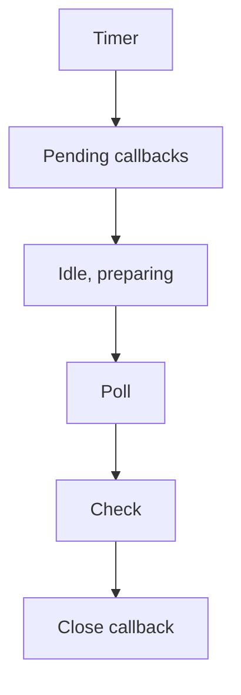

# NodeJS事件循环和定时器

## 什么是事件循环?

时间循环让NodeJS能够执行非阻塞的IO操作— 及时Javascript是单线程的— 通过尽可能地将操作卸载到系统内核。

Since most modern kernels are multi-threaded, they can handle multiple operations executing in the background. When one of these operations completes, the kernel tells Node.js so that the appropriate callback may be added to the **poll** queue to eventually be executed. We'll explain this in further detail later in this topic.

## 事件循环

When Node.js starts, it initializes the event loop, processes the provided input script (or drops into the [REPL](https://nodejs.org/api/repl.html#repl_repl), which is not covered in this document) which may make async API calls, schedule timers, or call `process.nextTick()`, then begins processing the event loop.

The following diagram shows a simplified overview of the event loop's order of operations.



Each box will be referred to as a "phase" of the event loop.

Each phase has a FIFO queue of callbacks to execute. While each phase is special in its own way, generally, when the event loop enters a given phase, it will perform any operations specific to that phase, then execute callbacks in that phase's queue until the queue has been exhausted or the maximum number of callbacks has executed. When the queue has been exhausted or the callback limit is reached, the event loop will move to the next phase, and so on.

Since any of these operations may schedule *more* operations and new events processed in the **poll** phase are queued by the kernel, poll events can be queued while polling events are being processed. As a result, long running callbacks can allow the poll phase to run much longer than a timer's threshold. See the [**timers**](https://nodejs.org/en/guides/event-loop-timers-and-nexttick#timers) and [**poll**](https://nodejs.org/en/guides/event-loop-timers-and-nexttick#poll) sections for more details.

There is a slight discrepancy(差异) between the Windows and the Unix/Linux implementation, but that's not important for this demonstration. The most important parts are here. There are actually seven or eight steps, but the ones we care about — ones that Node.js actually uses - are those above.

## 阶段概览

* **timers** : this phase executes callbacks scheduled by `setTimeout()` and `setInterval()`.
* **pending callbacks** : executes I/O callbacks deferred to the next loop iteration.
* **idle, prepare** : only used internally.
* **poll(轮询)** : retrieve new I/O events; execute I/O related callbacks (almost all with the exception of close callbacks, the ones scheduled by timers, and `setImmediate()`); **node will block here when appropriate**.
* **check** : `setImmediate()` callbacks are invoked here.
* **close callbacks** : some close callbacks, e.g. `socket.on('close', ...)`.

Between each run of the event loop, Node.js checks if it is waiting for any asynchronous I/O or timers and shuts down cleanly if there are not any.

## 阶段详情

### timers

A timer specifies the **threshold** *after which* a provided callback *may be executed* rather than the **exact** time a person  *wants it to be executed* . Timers callbacks will run as early as they can be scheduled after the specified amount of time has passed; however, Operating System scheduling or the running of other callbacks may delay them.

Technically, the [**poll** phase](https://nodejs.org/en/guides/event-loop-timers-and-nexttick#poll) controls when timers are executed.

For example, say you schedule a timeout to execute after a 100 ms threshold, then your script starts asynchronously reading a file which takes 95 ms:

```js
const fs = require('fs');
function someAsyncOperation(callback) {
// Assume this takes 95ms to complete
  fs.readFile('/path/to/file', callback);
}
const timeoutScheduled = Date.now();
setTimeout(() => {
  const delay = Date.now() - timeoutScheduled;
  console.log(`${delay}ms have passed since I was scheduled`);
}, 100);
// do someAsyncOperation which takes 95 ms to complete
someAsyncOperation(() => {
  const startCallback = Date.now();  // do something that will take 10ms...
  while (Date.now() - startCallback < 10) {
    // do nothing
  }
});
```

When the event loop enters the **poll** phase, it has an empty queue (`fs.readFile()` has not completed), so it will wait for the number of ms remaining until the soonest timer's threshold is reached. While it is waiting 95 ms pass, `fs.readFile()` finishes reading the file and its callback which takes 10 ms to complete is added to the **poll** queue and executed. When the callback finishes, there are no more callbacks in the queue, so the event loop will see that the threshold of the soonest timer has been reached then wrap back to the **timers** phase to execute the timer's callback. In this example, you will see that the total delay between the timer being scheduled and its callback being executed will be 105ms.

To prevent the **poll** phase from starving(耗尽) the event loop, [libuv](https://libuv.org/) (the C library that implements the Node.js event loop and all of the asynchronous behaviors of the platform) also has a hard maximum (system dependent) before it stops polling for more events.

### pending callbacks

This phase executes callbacks for some system operations such as types of TCP errors. For example if a TCP socket receives `ECONNREFUSED` when attempting to connect, some *nix systems want to wait to report the error. This will be queued to execute in the **pending callbacks** phase.

### poll(轮询)

The **poll** phase has two main functions:

1. Calculating how long it should block and poll for I/O, then
2. Processing events in the **poll** queue.

When the event loop enters the **poll** phase  *and there are no timers scheduled* , one of two things will happen:

* *If the **poll** queue **is not empty*** , the event loop will iterate through its queue of callbacks executing them synchronously until either the queue has been exhausted, or the system-dependent hard limit is reached.
* *If the **poll** queue **is empty*** , one of two more things will happen:
* If scripts have been scheduled by `setImmediate()`, the event loop will end the **poll** phase and continue to the **check** phase to execute those scheduled scripts.
* If scripts **have not** been scheduled by `setImmediate()`, the event loop will wait for callbacks to be added to the queue, then execute them immediately.

Once the **poll** queue is empty the event loop will check for timers  *whose time thresholds have been reached* . If one or more timers are ready, the event loop will wrap back to the **timers** phase to execute those timers' callbacks.

### check

This phase allows a person to execute callbacks immediately after the **poll** phase has completed. If the **poll** phase becomes idle and scripts have been queued with `setImmediate()`, the event loop may continue to the **check** phase rather than waiting.

`setImmediate()` is actually a special timer that runs in a separate phase of the event loop. It uses a libuv API that schedules callbacks to execute after the **poll** phase has completed.

Generally, as the code is executed, the event loop will eventually hit the **poll** phase where it will wait for an incoming connection, request, etc. However, if a callback has been scheduled with `setImmediate()` and the **poll** phase becomes idle, it will end and continue to the **check** phase rather than waiting for **poll** events.

### close callbacks

If a socket or handle is closed abruptly (e.g. `socket.destroy()`), the `'close'` event will be emitted in this phase. Otherwise it will be emitted via `process.nextTick()`.

## `setImmediate()` vs `setTimeout()`

`setImmediate()` and `setTimeout()` are similar, but behave in different ways depending on when they are called.

* `setImmediate()` is designed to execute a script once the current **poll** phase completes.
* `setTimeout()` schedules a script to be run after a minimum threshold in ms has elapsed.

The order in which the timers are executed will vary depending on the context in which they are called. If both are called from within the main module, then timing will be bound by the performance of the process (which can be impacted by other applications running on the machine).

For example, if we run the following script which is not within an I/O cycle (i.e. the main module), the order in which the two timers are executed is non-deterministic, as it is bound by the performance of the process:

JS

```js
// timeout_vs_immediate.js
setTimeout(() => {
  console.log('timeout');
}, 0);
setImmediate(() => {
  console.log('immediate');
});
```
