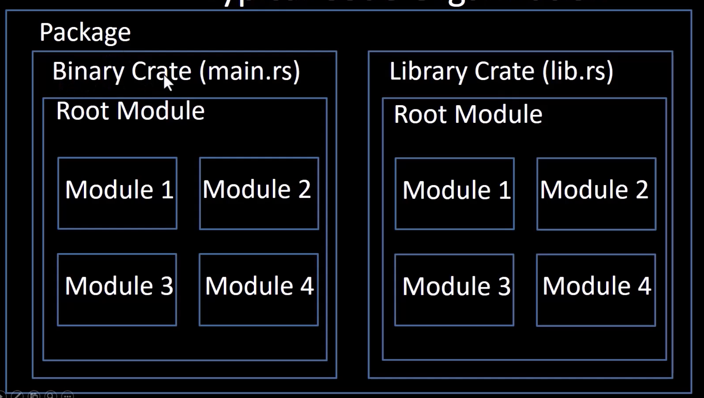
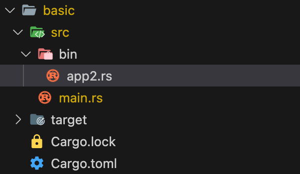

## Package、Crate、Module

Package、Create和Module的关系如下图：



- 当我们用 `cargo new some_name`创建一个rust项目时就对一个 `package`，类似于一个工作空间；
- `crate`代表一个包，分为二进制包（`binary crate`）和库包（`library crate`），一个package可以同时包含多个 `library crate`和一个 `binary crate`。按照惯例当 `package`中包含多个 `binary crate`时可以将他们放在 __bin__ 目录中，通过 `cargo run --bin crate-name`执行指定的crate；

  
- 当二进制crate文件未指定crate name时默认与package name相同，可以在Cargo.toml中加入如下配置指定bin name，然后通过命令 `cargo run --bin app2`执行app2对应的二进制程序：

  ```
  [[bin]]
  name = "app2"
  path = "src/bin/app2.rs"
  ```

## Module
