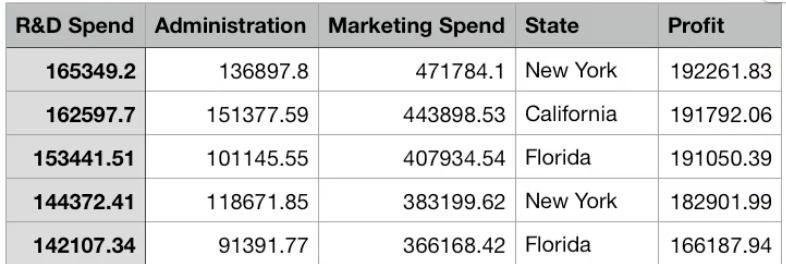
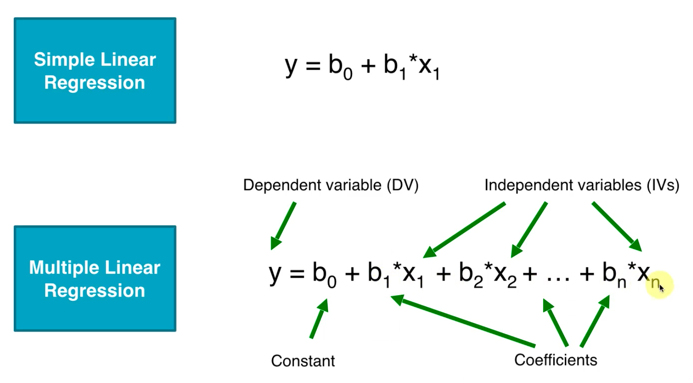
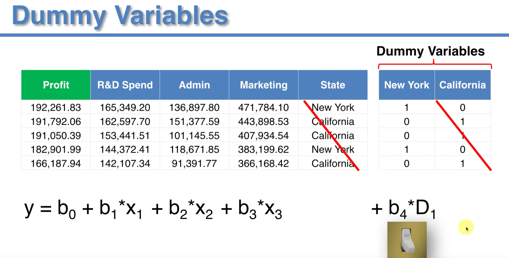
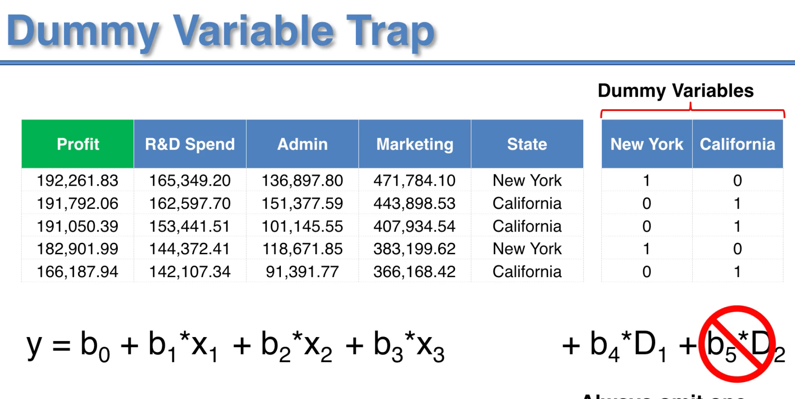
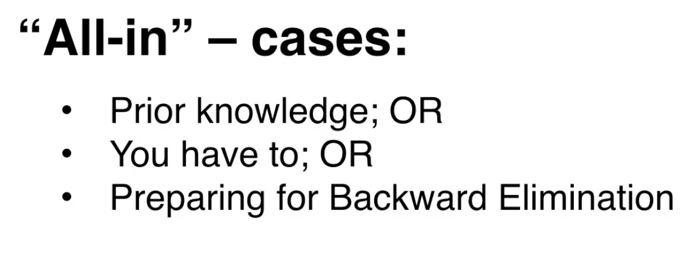
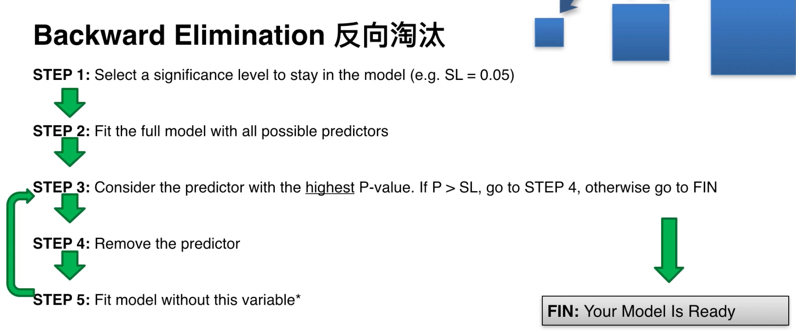
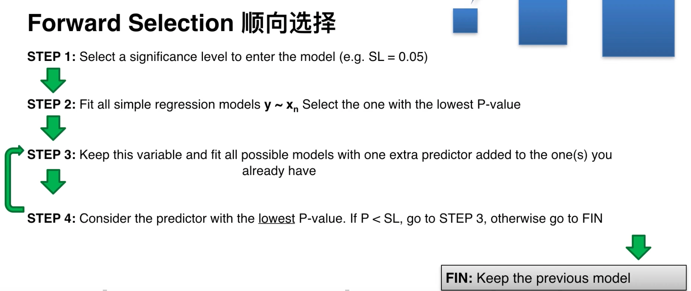
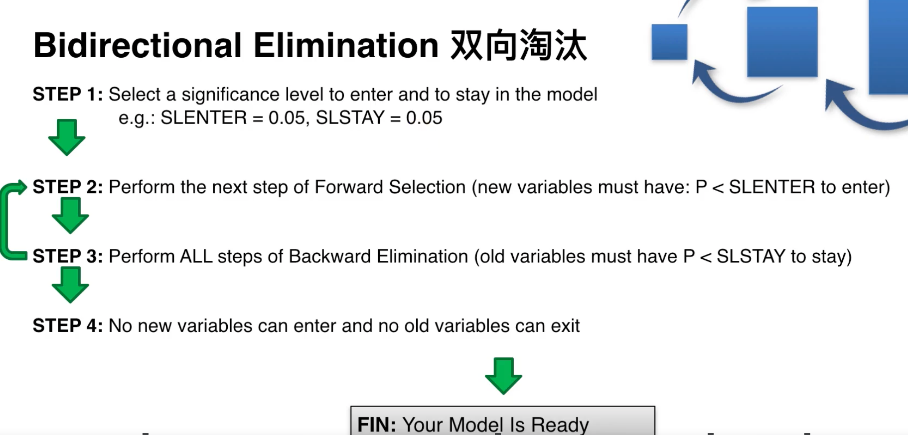
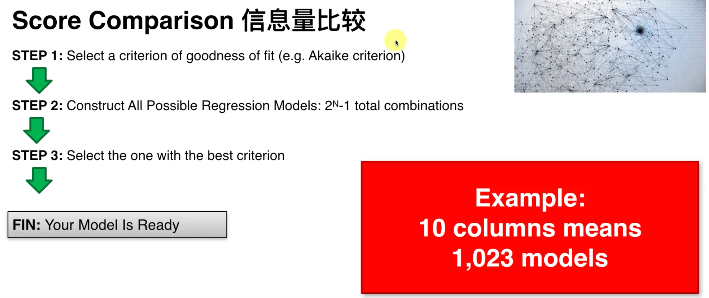

### 原理

相对于简单线性回归，多元线性回归自变量的个数大于1。比如下面的数据，前四列是自变量，最后一列是因变量。



与简单线性回归的比较：



#### 满足线性回归的假设：

- 线性
- 同方差性
- 多元正态分布
- 误差独立
- 无多重共线性

#### 虚拟变量

虚拟变量就是对分类数据数值化之后的结果，在数据预处理中提到使用Onehot编码分类数据，下图是对城市列编码之后的结果。



虚拟变量陷阱：如上图，我们对城市进行编码之后产生了两个新的列，但是已知其中一列的结果令一列的结果也是明确的，意味着两列数据是满足某种线性关系的，不满足我们之前对线性回归的假设，所以应该删除多余列。



#### 构建模型的5种方法

1. All-in



2. 反向淘汰



3. 顺向选择



4. 双向淘汰



5. 信息量比较



### 代码示例

In Python:

```python
import pandas as pd
import numpy as np

dataset = pd.read_csv("50_Startups.csv")
X = dataset.iloc[:, :-1].values
y = dataset.iloc[:, 4].values

from sklearn.impute import SimpleImputer
imputer = SimpleImputer(missing_values=0)
X[:, [0, 2]] = imputer.fit_transform(X[:, [0, 2]])

# dummy variable
from sklearn.preprocessing import LabelEncoder, OneHotEncoder
label_enc = LabelEncoder()
X[:, 3] = label_enc.fit_transform(X[:, 3])

from sklearn.compose import ColumnTransformer
onehot_enc = OneHotEncoder()
ct = ColumnTransformer([('name', onehot_enc, [3])], remainder="passthrough")
X = ct.fit_transform(X)
# dummy variable trap
X = X[:, 1:]

# 分割训练集和测试集
from sklearn.model_selection import train_test_split
train_X, test_X, train_y, test_y = train_test_split(X, y, test_size = 0.3, )

# 拟合模型，和简单线性回归相同
from sklearn.linear_model import LinearRegression
regressor = LinearRegression()
regressor.fit(train_X, train_y)
pred_y = regressor.predict(test_X)

train_X = np.append(np.ones((len(train_X), 1)), values = train_X, axis=1)

# 利用反向淘汰删除列
import statsmodels.api as sm
X_opt = train_X[:, [0, 1, 2, 3, 4, 5]]
X_opt = np.array(X_opt, dtype="float")
regressor_OLS = sm.OLS(endog = train_y, exog = X_opt).fit()
print(regressor_OLS.summary())

X_opt = train_X[:, [0, 1, 3, 4, 5]]
X_opt = np.array(X_opt, dtype="float")
regressor_OLS = sm.OLS(endog = train_y, exog = X_opt).fit()
print(regressor_OLS.summary())

#...
```

In R:

```

```
