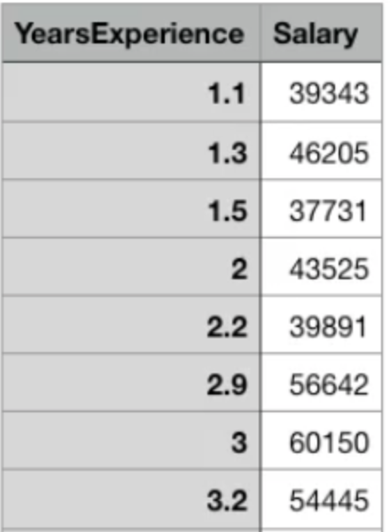
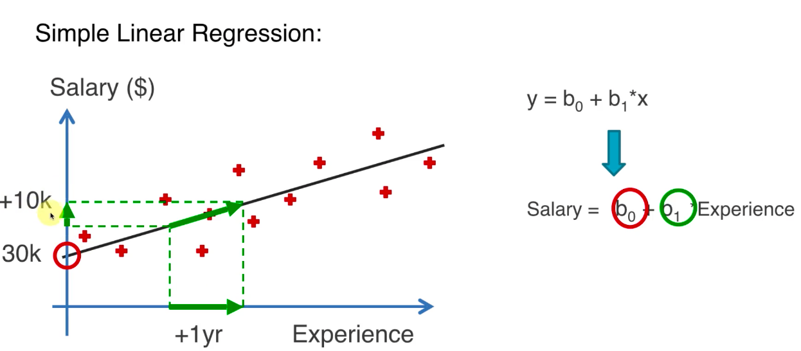
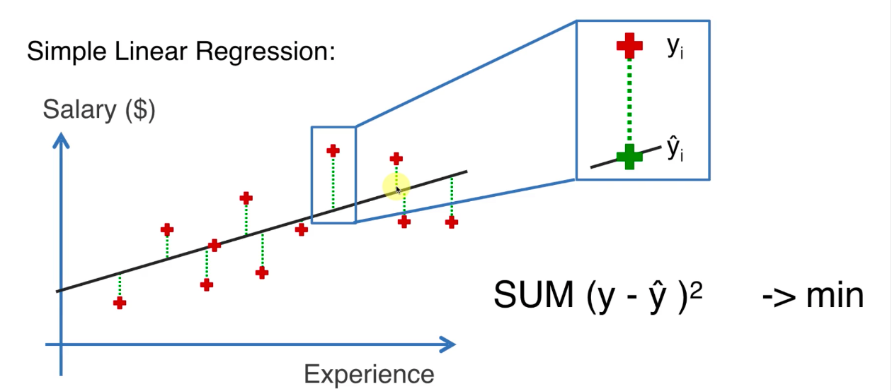
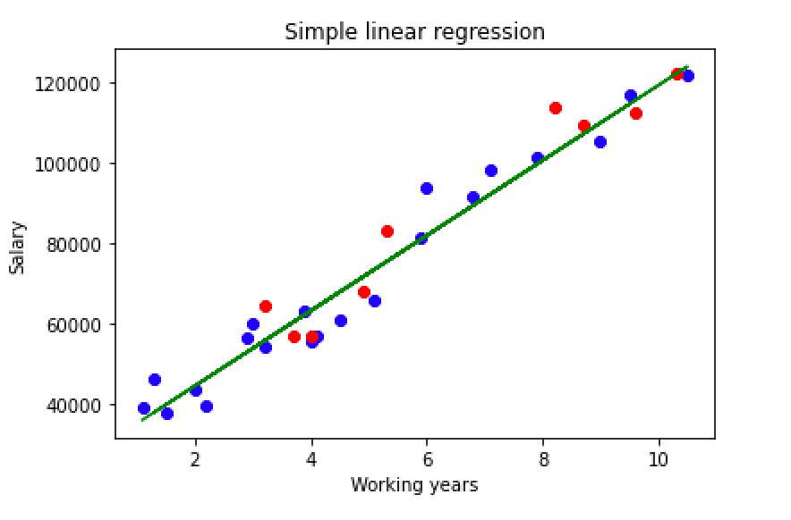

## 简单线性回归

### 原理

在简单线性回归中只有一个自变量，以下面的数据为例，自变量为 YearsExperience, 因变量为 Salary。



自变量和因变量满足线性关系：y = b0 + b1\*x。



从上图中可以看到，用了一条直线来拟合 Experience 和 Salary 之间的线性关系，b0 是直线与 y 轴的交点，b1 代表了直线的斜率。

简单线性回归就是要通过数学的方式计算出合理的 b0 和 b1, 那么如何评估模型的质量呢？如下图，当距离的平方和最小时我们认为模型拟合的越准确。



### 代码实现

- Python 代码实现：

```python
import matplotlib.pylab as plt
import pandas as pd

# loading data
dataset = pd.read_csv("Salary_Data.csv")
X = dataset.iloc[:, :-1]
y = dataset.iloc[:, 1]

# spliting to training set and testing set
from sklearn.model_selection import train_test_split
X_train, X_test, y_train, y_test = train_test_split(X, y, test_size=0.3, random_state=42)

# train model
from sklearn.linear_model import LinearRegression
regressor = LinearRegression()
regressor.fit(X_train, y_train)

predicates = regressor.predict(X_test)


# plot
plt.scatter(X_train, y_train, color="blue")
plt.scatter(X_test, y_test, color="red")
plt.plot(X_train, regressor.predict(X_train), color = "green")
plt.title("Simple linear regression")
plt.xlabel("Working years")
plt.ylabel("Salary")
plt.show()
```

- R 实现：

```R
dataset = read.csv("Salary_Data.csv")
library(caTools)
split = sample.split(dataset$Salary, SplitRatio = 0.7)
train_set = subset(dataset, split == TRUE)
testing_set = subset(dataset, split == FALSE)
regressor = lm(formula = Salary ~ YearsExperience, data = train_set)
pred_y = predict(regressor, testing_set)

library(ggplot2)
ggplot() +
  geom_point(aes(train_set$YearsExperience, train_set$Salary), color = "blue") +
  geom_line(aes(train_set$YearsExperience, predict(regressor, train_set), color = "red")) +
  geom_point(aes(testing_set$YearsExperience, testing_set$Salary), color = "green") +
  ggtitle("Salary vs YearsExperience") +
  xlab("YearsExperience") +
  ylab("Salary")
```

效果图（蓝色为训练集数据，红色为测试集数据)：


