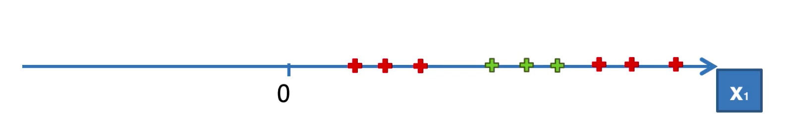
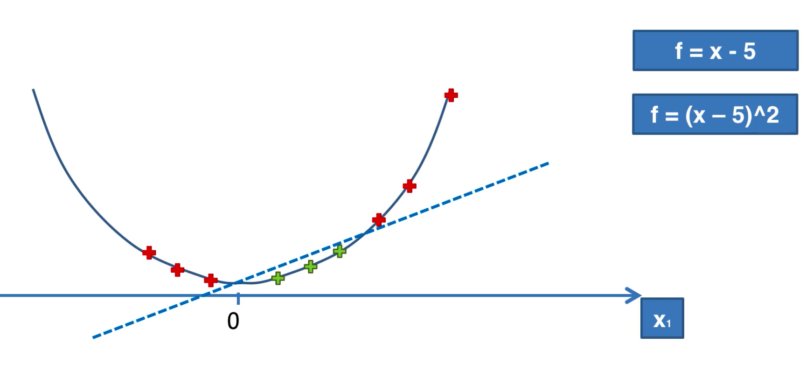
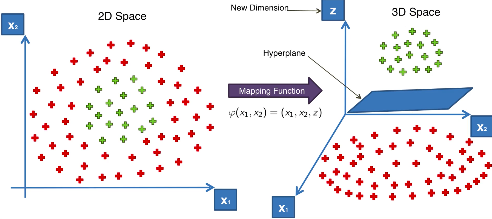
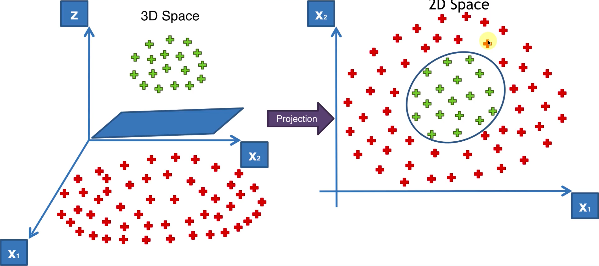
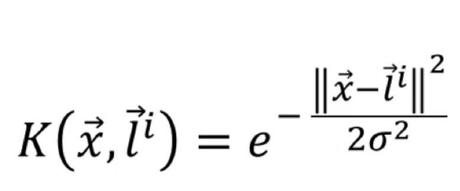
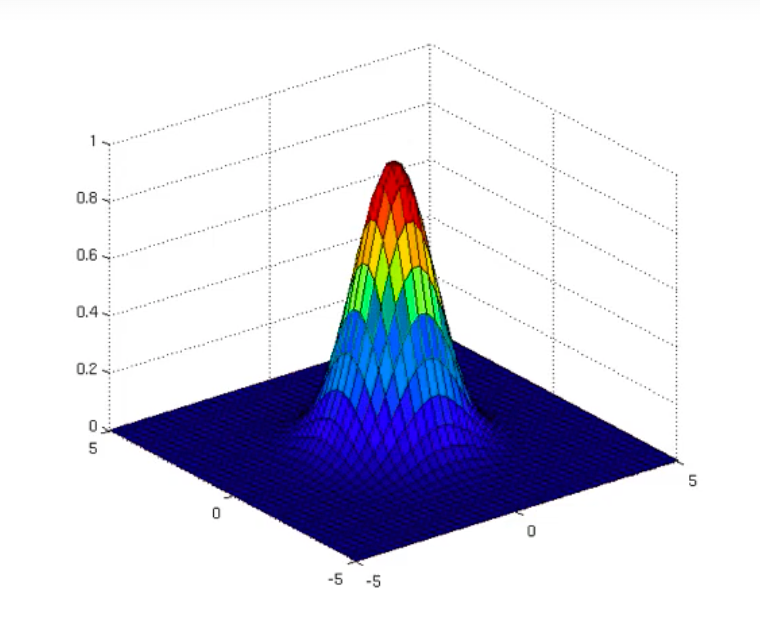
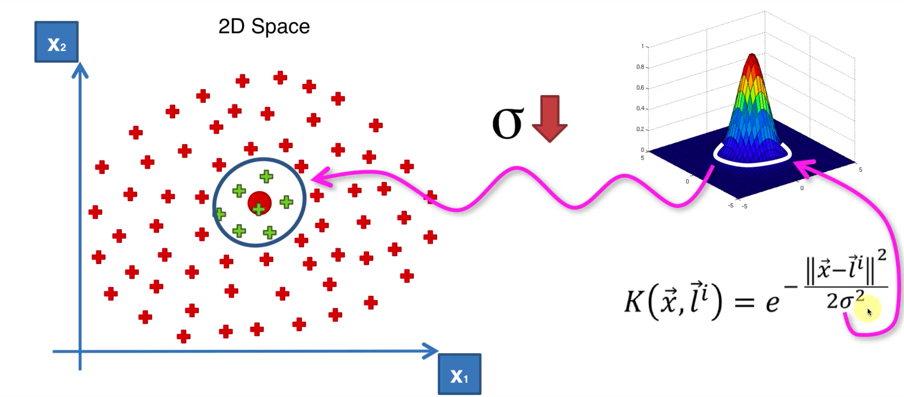
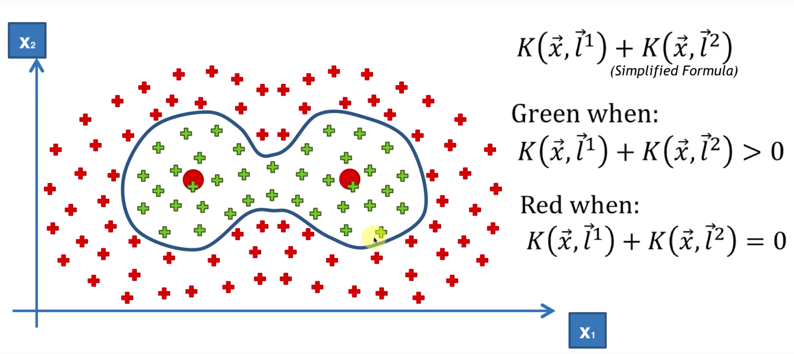

### 高维投射

- 考虑一维中的一些点，无法通过一条直线分割成两部分（如下图）：

通过二次函数投影之后的效果：

- 扩展到二位中的例子：

反向投影得到分类边界；

问题：映射到高维空间增加了计算开销...

### 核函数技巧

1. 高斯径向基核函数（Gaussian RBF Kernal）

`l`是一个基准向量，如果 `l`取原点的话，那么当x靠近原点时映射后的值接近1，而当x远离原点时映射后的值接近0，效果如下图：

系数的影响：

更复杂的场景可以考虑使用和函数的线性组合：

