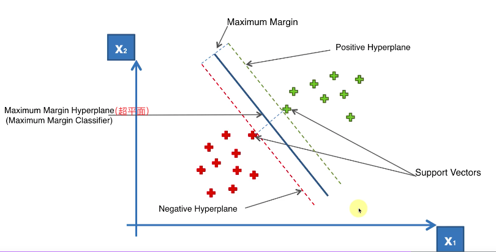
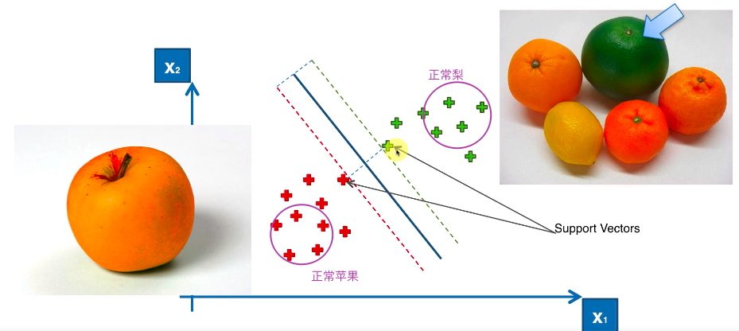
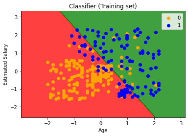

### 简介

超平面：



间隔（margin）：点到分割面的距离。

支持向量：离分割超平面最近的那些点。

特别之处（极端个例决定了分类结果）：



### 代码示例

与逻辑回归使用的数据相同。

Python(与逻辑回归差异部分):

```python
# Fitting the classifier to the Training set
# Create your classifier here
from sklearn.svm import SVC
classifier = SVC(kernel="linear", random_state=0)
classifier.fit(X_train, y_train)
```

效果：



R代码：

```r
# Fitting Kernel SVM to the Training set
# install.packages('e1071')
library(e1071)
classifier = svm(formula = Purchased ~ .,
                 data = training_set,
                 type = 'C-classification',
                 kernel = 'linear')


y_pred = predict(classifier, newdata = test_set[-3])

# Making the Confusion Matrix
cm = table(test_set[,3], y_pred)


# Visualising the Training set results
library(ElemStatLearn)
set = training_set
X1 = seq(min(set[, 1]) - 1, max(set[, 1]) + 1, by = 0.0075)
X2 = seq(min(set[, 2]) - 1, max(set[, 2]) + 1, by = 0.0075)
grid_set = expand.grid(X1, X2)
colnames(grid_set) = c('Age', 'EstimatedSalary')
y_grid = predict(classifier, newdata = grid_set)
plot(set[, -3],
     main = 'Classifier (Training set)',
     xlab = 'Age', ylab = 'Estimated Salary',
     xlim = range(X1), ylim = range(X2))
contour(X1, X2, matrix(as.numeric(y_grid), length(X1), length(X2)), add = TRUE)
points(grid_set, pch = '.', col = ifelse(y_grid == 1, 'springgreen3', 'tomato'))
points(set, pch = 21, bg = ifelse(set[, 3] == 1, 'green4', 'red3'))
```
