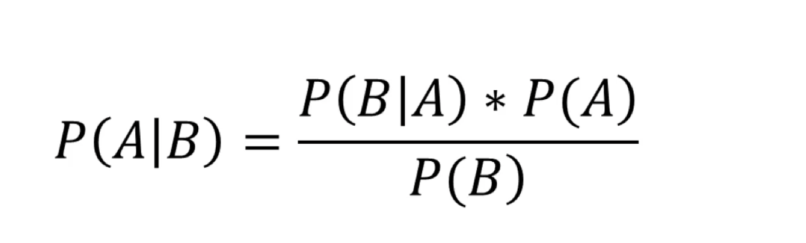
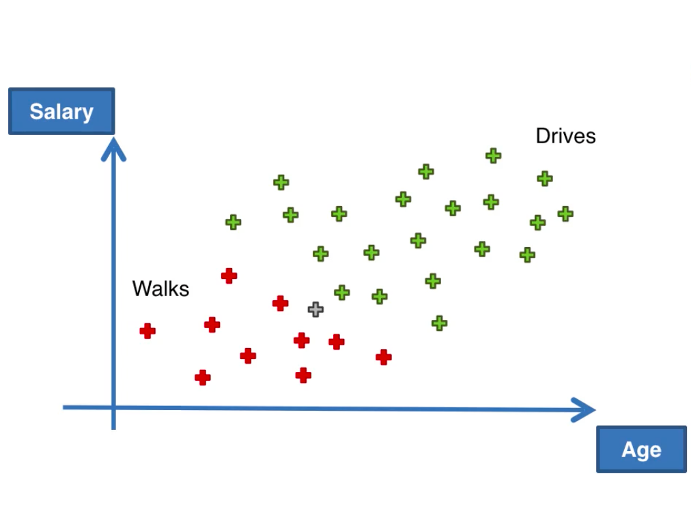
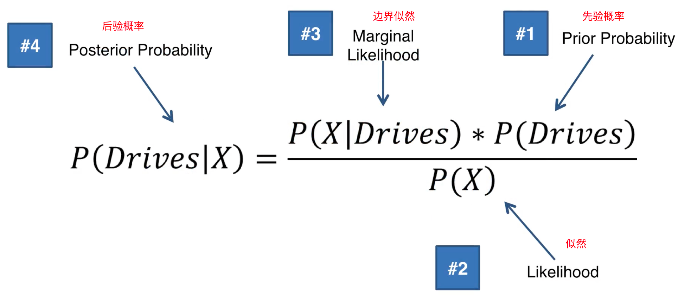
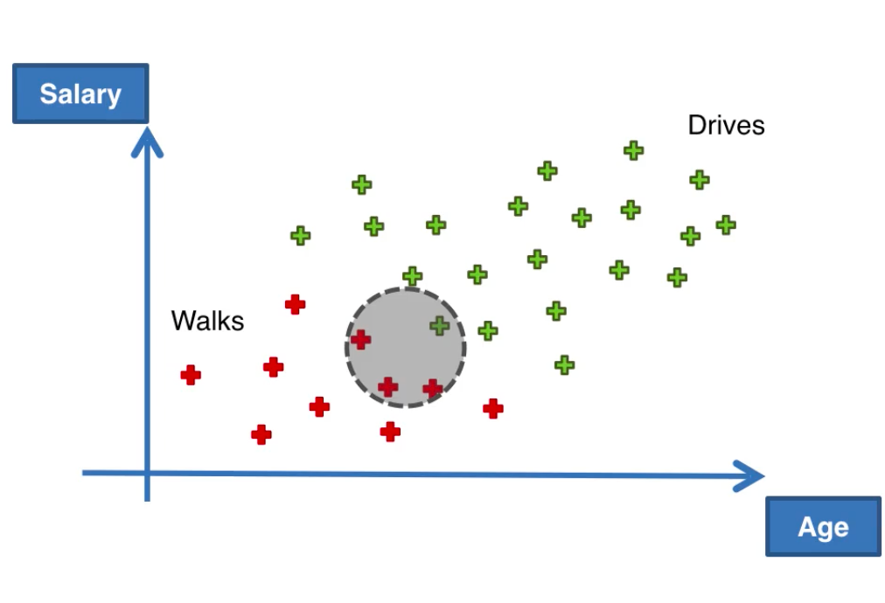
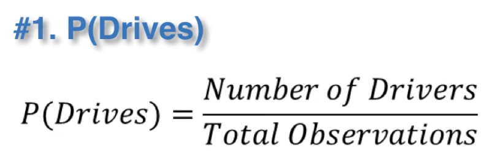
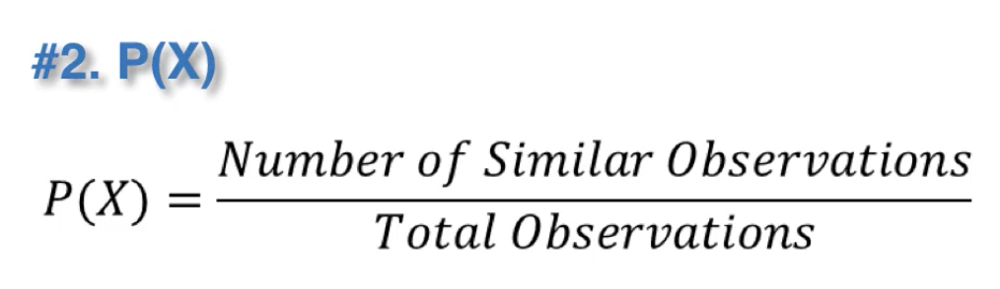
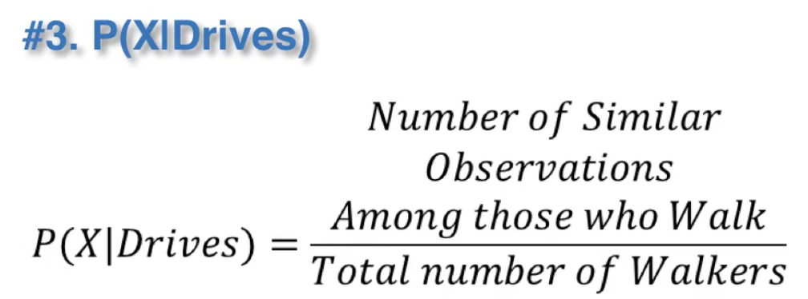
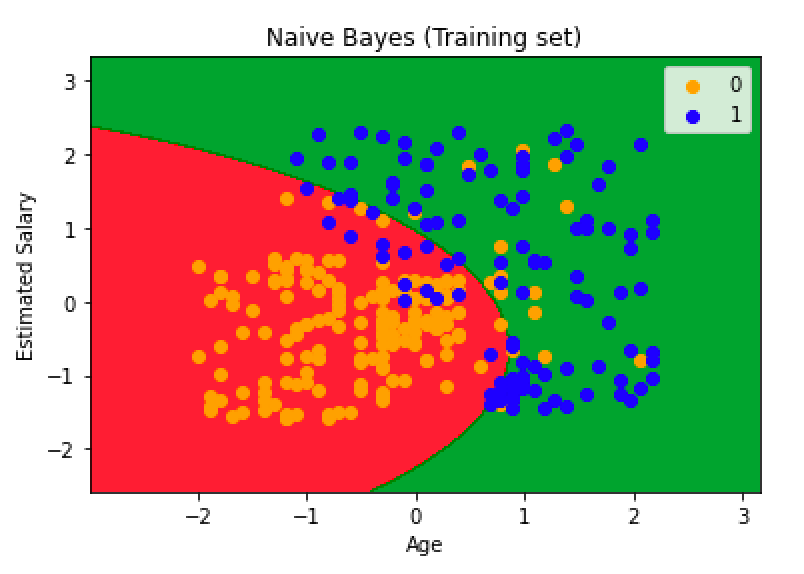

### 贝叶斯定理



### 原理

#### 举例

如图，已知员工的年龄和薪水以及该员工是否不行或开车去公司的数据，在知道新员工年龄和薪水的前提下判断他是否步行上班。



#### 计算步骤



X可以理解成与新员工特征（年龄和Salary）相近的数据，如下图中圆圈內的数据：



1. P(Drives)

   
2. P(X)

   
3. P(X | Drives) (**下图描述有误，应该是Drives**)

   
4. 根据上面的公式计算P(Drives|X)
5. 同理可以计算出P(Walks|X)，通过与P(Drives | X)进行比较，就可以对新员工的出行方式做出分类

### 补充

1. 为什么‘朴素’？
   独立假设：所有的特征相互独立。

### 代码示例

python:

```python
from sklearn.naive_bayes import GaussianNB
classifier = GaussianNB()
classifier.fit(X_train, y_train)
```

R:

```r
library(e1071)
classifier = naiveBayes(x = training_set[-3],
                        y = training_set$Purchased)
```

效果图：


