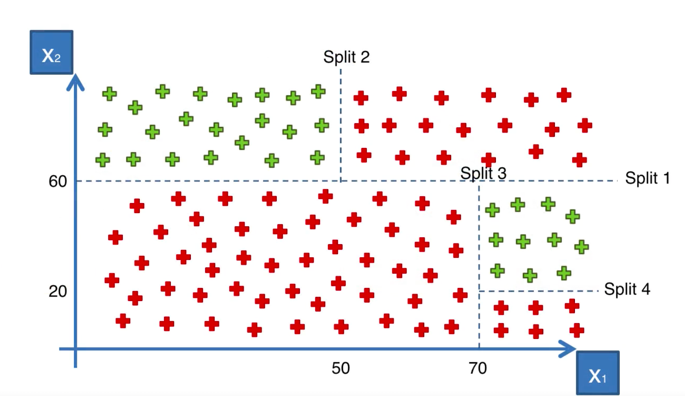
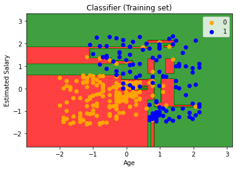

### 原理



### 示例

Python：

```python
# Fitting classifier to the Training set
from sklearn.tree import DecisionTreeClassifier
classifier = DecisionTreeClassifier(criterion = 'entropy', random_state = 0)
classifier.fit(X_train, y_train)
```

R:

```r
# Fitting Decision Tree to the Training set
# install.packages('rpart')
library(rpart)
classifier = rpart(formula = Purchased ~ .,
                   data = training_set)

# Predicting the Test set results
y_pred = predict(classifier, newdata = test_set[-3], type = 'class')
```

效果图：


