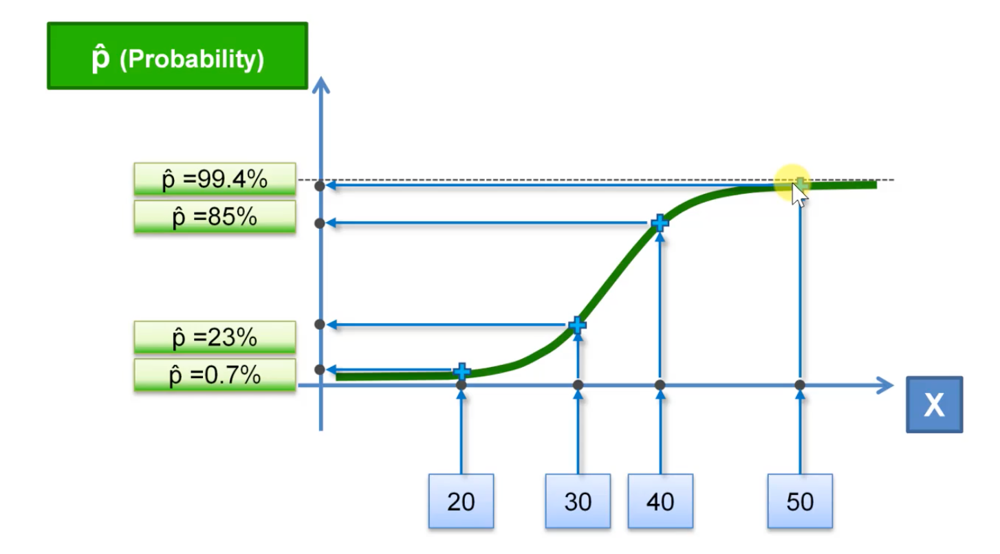

### 原理

Logistic回归的因变量是分类值，可以是二分类的，也可以是多分类的，但是二分类的更为常用，也更加容易解释。所以实际中最常用的就是二分类的Logistic回归。

如下图表示用户年龄与是否购买某个商品，因变量是否购买只有两种取值1或者0：


如果对数据进行简单线性回归，可以得到类似右上角的拟合线段，中间部分可以看作用户是否购买的概率：





### 代码示例

数据集的格式如下：


#### Python 实现

```python
import pandas as pd

dataset = pd.read_csv("Social_Network_Ads.csv")
X = dataset.iloc[:,2:4].values
y = dataset.iloc[:,4].values

# 特征缩放
from sklearn.preprocessing import StandardScaler
X_sc = StandardScaler()
X = X_sc.fit_transform(X)

# 分割数据集
from sklearn.model_selection import train_test_split
X_train, X_test, y_train, y_test = train_test_split(X, y, test_size=0.25, random_state=0)

# 创建分类器
from sklearn.linear_model import LogisticRegression
classifier = LogisticRegression(random_state=0)
classifier.fit(X_train, y_train)
y_pred = classifier.predict(X_test)

# 混淆矩阵验证实际值与预测值的差异
from sklearn.metrics import confusion_matrix
cm = confusion_matrix(y_test, y_pred) # [[65, 3], [8, 24]]
```

可以使用如下代码对结果进行可视化(针对训练集数据，测试集类似)：

```python
from matplotlib.colors import ListedColormap
X_set, y_set = X_train, y_train
X1, X2 = np.meshgrid(np.arange(start = X_set[:, 0].min() - 1, stop = X_set[:, 0].max() + 1, step = 0.01),
                     np.arange(start = X_set[:, 1].min() - 1, stop = X_set[:, 1].max() + 1, step = 0.01))
plt.contourf(X1, X2, classifier.predict(np.array([X1.ravel(), X2.ravel()]).T).reshape(X1.shape),
             alpha = 0.75, cmap = ListedColormap(('red', 'green')))
plt.xlim(X1.min(), X1.max())
plt.ylim(X2.min(), X2.max())
for i, j in enumerate(np.unique(y_set)):
    plt.scatter(X_set[y_set == j, 0], X_set[y_set == j, 1],
                c = ListedColormap(('orange', 'blue'))(i), label = j)
plt.title('Logistic Regression (Training set)')
plt.xlabel('Age')
plt.ylabel('Estimated Salary')
plt.legend()
plt.show()
```

结果如下：


#### R实现

```r
dataset = read.csv("Social_Network_Ads.csv")
dataset = dataset[,3:5]

library(caTools)
split = sample.split(y, SplitRatio = 0.75)
train_set = subset(dataset, split == TRUE)
test_set = subset(dataset, split == FALSE)

train_set[,1:2] = scale(train_set[,1:2])
test_set[, 1:2] = scale(test_set[,1:2])

classifier = glm(formula = Purchased ~ ., family = binomial, data = train_set)
prob_pred = predict(classifier, type = "response", newdata = test_set)
y_pred = ifelse(prob_pred>0.5, 1, 0)

# Create Confusion Matrix
cm = table(test_set[, 3], y_pred)
```

对结果进行可视化：

```r
# install.packages("ElemStatLearn")
library(ElemStatLearn)
set = train_set
X1 = seq(min(set[, 1]) - 1, max(set[, 1]) + 1, by = 0.0075)
X2 = seq(min(set[, 2]) - 1, max(set[, 2]) + 1, by = 0.0075)
grid_set = expand.grid(X1, X2)
colnames(grid_set) = c('Age', 'EstimatedSalary')
prob_set = predict(classifier, type = 'response', newdata = grid_set)
y_grid = ifelse(prob_set > 0.5, 1, 0)
plot(set[, -3],
     main = 'Classifier (Training set)',
     xlab = 'Age', ylab = 'Estimated Salary',
     xlim = range(X1), ylim = range(X2))
contour(X1, X2, matrix(as.numeric(y_grid), length(X1), length(X2)), add = TRUE)
points(grid_set, pch = '.', col = ifelse(y_grid == 1, 'springgreen3', 'tomato'))
points(set, pch = 21, bg = ifelse(set[, 3] == 1, 'green4', 'red3'))
```

训练集数据的可视化效果：


