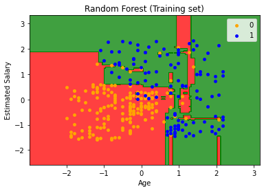

### 原理

- STEP 1: Pick at random K data points from the training set
- SETP 2: Build the Decision Tree associated to those K data
- STEP 3: Choose the number Ntree of trees you want to build and repeat STEPS 1 & 2
- STEP 4: For a new data point, make each one of you Ntree trees predict the category to which the data points belong, and assign the new data point to the category that wins the majority vote

### 示例

Python：

```python
# Fitting Random Forest to the Training set
from sklearn.ensemble import RandomForestClassifier
classifier = RandomForestClassifier(n_estimators = 10, criterion = 'entropy', random_state = 0 )
classifier.fit(X_train, y_train)
```

R:

```python
# Fitting Random Forest Classification to the Training set
# install.packages('randomForest')
library(randomForest)
classifier = randomForest(x = training_set[-3],
                          y = training_set$Purchased,
                          ntree=10)

# Predicting the Test set results
y_pred = predict(classifier, newdata = test_set[-3])
```

效果：


