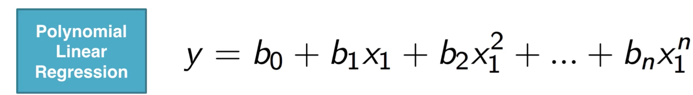
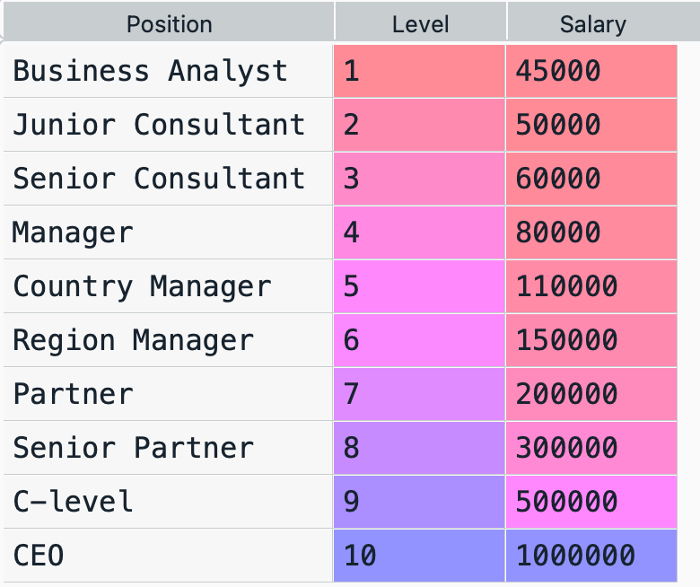
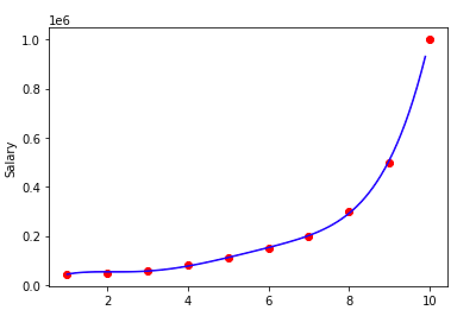

### 原理

多项式回归和多元线性回归非常相似，可以看做是将多元线性回归中多个自变量替换成了单个自变量的不同次幂，因此使用的建模方式也和多元线性回归完全一样。



### 代码示例

原始数据如下：



- Python代码：

```python
import pandas as pd

dataset = pd.read_csv("Position_Salaries.csv")
X = dataset.iloc[:, 1:2].values
y = dataset.iloc[:, 2].values

from sklearn.linear_model import LinearRegression
regressor = LinearRegression()

from sklearn.preprocessing import PolynomialFeatures
poly = PolynomialFeatures(degree = 5)
X_poly = poly.fit_transform(X)

regressor.fit(X_poly, y)

import matplotlib.pyplot as plt
plt.scatter(X, y, color = "red")

import numpy as np
# 对X进行插值用于绘制平滑的曲线
X_ext = np.arange(min(X), max(X), 0.1)
# 向量转矩阵
X_ext = X_ext.reshape(len(X_ext), 1)
plt.plot(X_ext, regressor.predict(poly.transform(X_ext)), color="blue")
plt.xlabel("Position")
plt.ylabel("Salary")
plt.show()
```

- R代码：

  ```R
  dataset = read.csv("Position_Salaries.csv")

  dataset$Level2 = dataset$Level^2
  dataset$Level3 = dataset$Level^3
  dataset$Level4 = dataset$Level^4
  dataset$Level5 = dataset$Level^5

  regressor = lm(Salary ~ ., data = dataset)

  library(ggplot2)
  ggplot() + geom_point(aes(dataset$Level, dataset$Salary), color='red') +
    geom_line(aes(dataset$Level, predict(regressor, dataset)), color='green') +
    ggtitle('Position vs Salary') +
    xlab('Position') +
    ylab('Salary')

  y_pred = predict(regressor, data.frame(Level = 6.5,
                                         Level2 = 6.5^2,
                                         Level3 = 6.5^3,
                                         Level4 = 6.5^4,
                                         Level5 = 6.5^5))
  ```
  最终的建模效果：

  
