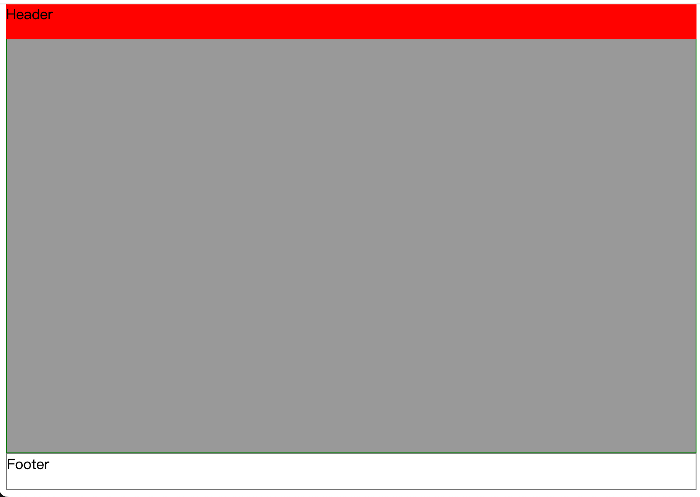
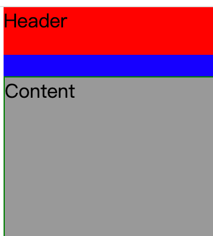

### 简介

通过 `position`属性对元素进行定位时可以使用 `sticky`属性值将元素固定到指定的位置。当滚动页面时可能希望将某个元素固定到视口的顶部，例如页面的Header信息，这个时候就可以给需要固定的元素设置 `position: sticky`即可，否则就只能借助js监听页面的滚动事件动态调整元素样式来实现。

```html
<!DOCTYPE html>
<html lang="en">
<head>
  <meta charset="UTF-8">
  <meta name="viewport" content="width=device-width, initial-scale=1.0">
  <title>Document</title>
  <style>
    header {
      background-color: red;
      height: 40px;
      position: sticky;
      top: 0px;
    }
    main {
      border: 1px solid green;
      height: 600px;
      background-color: #999;
    }
    footer {
      border: 1px solid grey;
      height: 40px;
    }
  </style>
</head>
<body>
  <header>Header</header>
  <main>Content</main>
  <footer>Footer</footer>
</body>
</html>
```

在上面的例子中当页面滚动时header元素始终保持页面的顶部，效果如下：



### 注意事项

设置sticky的元素吸附的区域收到父元素的限制，也就是说当父元素覆盖的区域不再包含sticky元素粘附的区域时，sticky效果将失效。sticky元素会被父元素带走。

在上面的例子中，sticky之所以生效，是因为header粘附在顶部的时候始终在父元素body中，假设我们将header包裹在另一个元素中，stick效果将失效，因为随着页面的滚动，新的父元素会离开可是区域。

```html
<body>
  <div>
    <header>Header</header>
  </div>
  <main>Content</main>
  <footer>Footer</footer>
</body>
```

按上面的代码调整HTML结构后，sticky失效。

当我们给父元素一个大于header元素的高度时，在父元素离开浏览器视口之前sticky效果正常:

```html
  <div style="height: 100px; background-color: blue;">
    <header>Header</header>
  </div>
```

效果如下：


