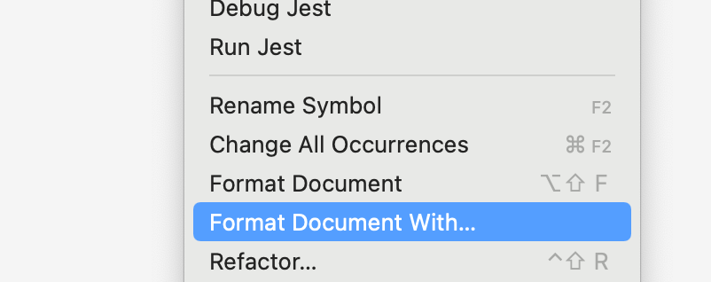
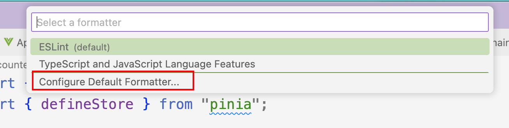

### 创建单页应用

在shell中运行命令 `npm init vue@latest`，该命令会下载并运行Vue的官方脚手架 `create-vue`，根据提示选择项目需要使用的功能特性。项目创建成功后根据console提示在本地启动应用。

### 常见问题

1. 配置了多个lint工具（eslint、prettier、vue相关插件等）产生冲突，可以手动配置默认的格式化工具，或禁用掉多余的lint工具，配置默认formatter的方式如下：

- 右键选择 `Format Document with...`:

- 点击 `Configure Default Formatter...`，选择想要设置的formatter即可。

	
