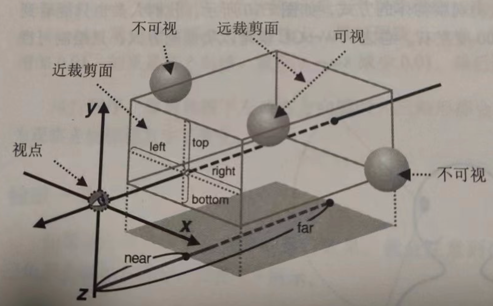
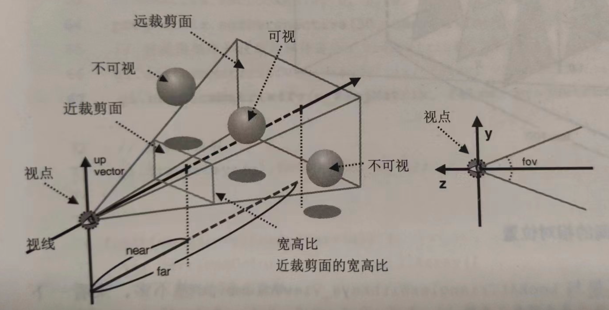
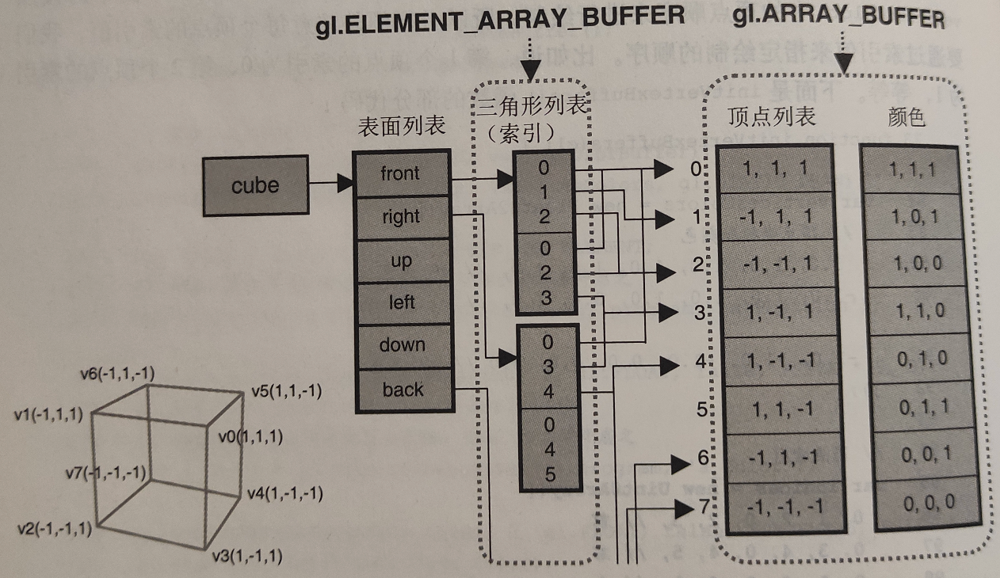

### 视点和视线

__视点__：观察者所在的位置；

__视线__：从观察者出发沿着观察方向的射线；

__观察目标点__： 观察目标所在的点；

__上方向__：最终绘制在屏幕上的图像的向上的方向；

可以通过上述的三个矢量（视点、观察目标点、上方向）创建 `视图矩阵`, 然后将视图矩阵传递给顶点着色器，视图矩阵描述了观察者的信息。可以通过Matrix4.setLookAt(eyeX, eyeY, eyeY, atX, atY, atZ, upX, upY, upZ)设置视图矩阵的三个矢量。

默认的视点为坐标原点（0，0，0）；

默认的观察目标点在（0， 0，-1）的位置；

默认的上方向为y轴正方向（0，1，0），如过把上方向调整为x轴正方向则相当于将图像90度旋转；

**创建视图矩阵：**

```js
var initialViewMatrix = new Matrix4();
initialViewMatrix.setLookAt(0,0,0,0,0,-1,0,1,0);
```

__模型矩阵__：缩放、平移、旋转等基础变换矩阵及它们的组合。

**创建模型矩阵**：

```js
var modelMatrix = new Matrix4();
modelMatrix.setRotate(-10, 0, 0, 1); // Rotate around z-axis
```

#### 示例程序（片段）

    1. 顶点着色器

```c
uniform mat4 u_ViewMatrix;
attribute vec4 a_Position;
void main() {
	gl_Position = u_ViewMatrix * a_Position;
}
```

2. 主程序

```js
var u_ViewMatrix = gl.getUniformLocation(gl.program, 'u_ViewMatrix');
var viewMatrix = new Matrix4();
viewMatrix.setLookAt(0.25, 0.25, 0.25, 0, 0, 0, 0, 1, 0);
gl.uniformMatrix4fv(u_ViewMatrix, false, viewMatrix.elements);
```

<顶点的最终坐标> = <视图矩阵> x <模型矩阵> x <原始顶点坐标>;

避免重复计算，可以同时设置模型视图矩阵：`viewMatrix.rotate(...)`;

### 可视范围

两类常用可视空间：

- 长方体可视空间，也称盒状可视空间，由正射投影产生；
- 四棱锥/金字塔可视空间，由透视投影产生；

#### 盒状可视空间

由前后两个表面构成，分别称为近裁剪面和远裁剪面。



`<canvas>`显示的是可视空间中物体在近裁剪面上的投影，如果近裁剪面的宽高比与canvas不一致，画面会被压缩；

#### 定义盒状状可视空间

通过设置 `正射投影矩阵`定义盒状可视空间：

```js
Matrix4.setOrtho(left, right, bottom, top, near, far);
```

`<正射投影> * <视图矩阵> * <顶点坐标>`;

#### 透视投影可视空间



定义透视投影矩阵：

```js
// fov: 垂直视角； aspect: 宽高比
Matrix4.setPerspective(fov, aspect, near, far);
```

### 处理对象的前后关系

Webgl按照顶点在缓冲区的顺序进行绘制，后绘制的图像会覆盖已经绘制好的图像。

#### 隐藏面消除

步骤：

1. 启用隐藏面消除功能；
2. 在绘制之前清除深度缓冲区；

示例：

```js
gl.enable(gl.DEPTH_TEST);
// 同时清除颜色缓冲区和深度缓冲区
gl.clear(gl.COLOR_BUFFER_BIT | gl.DEPTH_BUFFER_BIT);
```

#### 深度冲突

由于深度缓冲区的精度有限，当两个物体的表面很接近时，绘制的表面可能会斑斑驳驳。

#### 多边形偏移

自动在Z值上增加一个偏移量，偏移量的值取决于物体表面与观察者视线的角度；

启用多边形偏移功能：

1. 启用多边形偏移；
2. 绘制之前提供计算偏移量的参数；
   `gl.polygonOffset(factor, units)`: 偏移量等于 m * factor + r * units, r表示顶点所在表面与观察者视线的角度，r表示设备能够识别的z值之差的最小值。

示例：

```js
gl.enable(gl.POLYGON_OFFSET_FILL);
// 绘制第一个三角形
gl.drawArrays(gl.TRIANGLE, 0, 3);
gl.polygonOffset(1.0, 1.0);
// 绘制第二个三角形
gl.drawArrays(gl.TRIANGLE, 3, 3);
```

### 立方体

通过三角形绘制立方体时，每个平面都需要绘制两个三角形，通过gl.TRIANGLES时总共需要指定36个坐标点（gl.TRIANGLE_FAN或gl.TRIANGLE_STRIP可以适当减少顶点数）。

#### 通过顶点索引绘制物体

`gl.drawElements(mode, count, type, offset)`: 根据gl.ELEMENT_ARRAY_BUFFER缓冲区中存储的顶点索引值绘制图形。

`mode`: 指定绘制方式，可以接受的常量有：gl.POINTS, gl.LINES, gl.LINE_STRIP, gl.LINE_LOOP, gl.TRIANGLES, gl.TRIANGLE_STRIP, gl.TRIANGLE_FAN;

`count`:绘制的顶点个数；

`type`:索引值数据类型，gl.UNSIGNED_BYTE, gl.UNSIGNED_SHORT;

`offset`:索引数组中开始绘制的位置，以字节为单位；

示例程序(片段)：

```js
void main() {
  // 设置顶点坐标和颜色
  var n = initVertexBuffers();

  // 开启隐藏面消除
  gl.enable(gl.DEPTH_TEST);

  // 清除颜色缓冲区和深度缓冲区
  gl.clear(gl.COLOR_BUFFER_BIT | gl.DEPTH_BUFFER_BIT);
  // 绘制立方体
  gl.drawElements(gl.TRIANGLES, n, gl.UNSIGNED_BYTE, 0);
}

function initVertexBuffers() {
  // 参考下图
  // 顶点坐标和颜色
  var verticesColors = [
    1.0, 1.0, 1.0, 1.0, 1.0, 1.0, // v0
    //...
  ];
  // 顶点索引
  var indices = [
    0, 1, 3, 0, 2, 3,
    0, 3, 4, 0, 4, 5,
    // ...
  ];
  // 创建顶点缓冲区并传递给顶点着色器中的变量（略）
  // 创建索引缓冲区
  var indexBuffer = gl.createBuffer();
  gl.bindBuffer(gl.ELEMENT_ARRAY_BUFFER, indexBuffer);
  gl.bufferData(gl.ELEMENT_ARRAY_BUFFER, indices, gl.STATIC_DRAW);

  return indices.length;
}
```

立方体的顶点信息：



### 补充： 世界坐标系与局部坐标系

世界坐标系和局部坐标系是在计算机图形学中常用的两种坐标系。世界坐标系是一个全局的坐标系，用于描述场景中所有物体的位置和方向。而局部坐标系是相对于某个物体的坐标系，用于描述该物体内部的位置和方向。

举个例子，假设有一个三维场景，其中有一个立方体。在世界坐标系中，我们可以描述立方体的位置和方向，比如说它的中心点在坐标轴原点，朝向是沿着Y轴正方向。而在立方体的局部坐标系中，我们可以描述立方体内部的位置和方向，比如说它的一个顶点在局部坐标系中的坐标是(0,0,0)。

在计算机图形学中，我们通常需要将物体从世界坐标系转换到局部坐标系，或者将局部坐标系转换到世界坐标系。这个过程通常涉及到矩阵变换，比如平移、旋转、缩放等。理解世界坐标系和局部坐标系的概念对于进行这些变换非常重要。

注： Matrix4的相关实现课参考[这里](https://github.com/helloweilei/webgl/tree/master/examples/lib)
