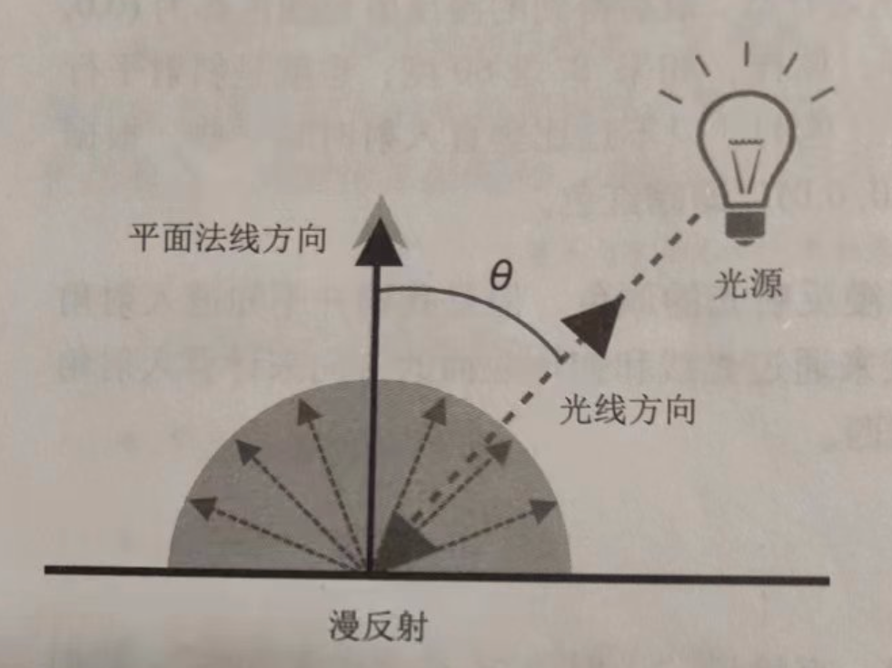
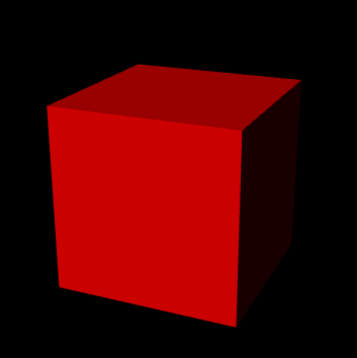
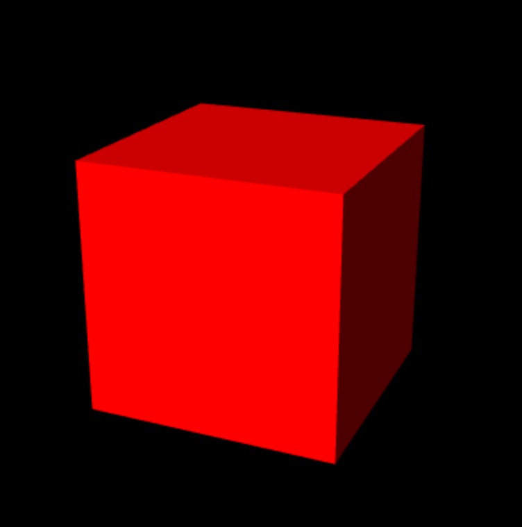
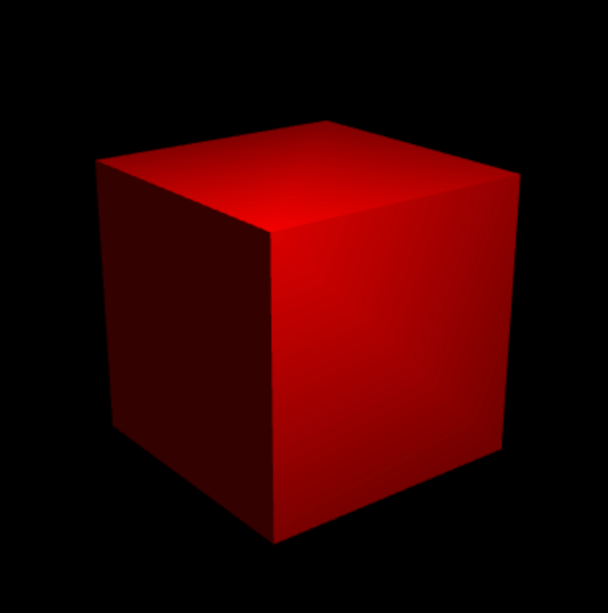

### 光照原理

#### 光源类型

- **平行光**，可看作无限远处的光源（如太阳）发出的光。
- **点光源光**， 如灯泡、火焰等；需要指定位置和颜色。
- **环境光**，由点光源（或平行光）发出的光，经过墙体等物体的反射后照射到物体表面的光。从各个物体照射到物体表面，强度一致；只需指定强度。

### 反射类型

反射光的信息取决于入射光和物体表面的类型，入射光包括入射方向和颜色，物体表面类型包括物体固有颜色（基底色）和反射特性；

#### 漫反射

漫反射的反射光在各个方向上是均匀的，反射光的颜色取决于入射光的颜色、表面的基底色以及入射光与表面形成的入射角，计算公式：

`<漫发射的颜色>` = <入射光的颜色> x <表面的基底色> x cos(入射角)

乘法操作在颜色矢量上逐分量进行。

#### 环境反射

针对环境光而言的，反射光的方向可以认为是入射光的反方向，且反射光是各向均匀的，计算方式：

`<环境反射的颜色>` = <入射光的颜色> x <表面的基底色>

物体最终被观察到的颜色：

`<表面的反射光颜色>` = <漫反射光颜色> + <环境反射光颜色>

### 平行光下的漫反射

平行光的方向是唯一的，对于平面上每一个点入射角相同，计算比较容易。

#### 确定入射角

入射角的余弦值可以通过入射光线与平面法向量的点积得到：

`cos(入射角) = <入射方向> * <光线方向>`

计算之前需要将入射方向与法线方向 `归一化`，且光线方向使用入射方向的反方向。



#### 示例程序

```js
// LightedCube.js (c) 2012 matsuda
// Vertex shader program
var VSHADER_SOURCE = 
  // ...
  'attribute vec4 a_Normal;\n' +        // 法向量
  // ...
  'uniform vec3 u_LightColor;\n' +     // 光线颜色
  'uniform vec3 u_LightDirection;\n' + // 归一化的光线方向（世界坐标系）
  'varying vec4 v_Color;\n' +
  'void main() {\n' +
  // ...
  // 归一化
  '  vec3 normal = normalize(a_Normal.xyz);\n' +
  // Dot product of the light direction and the orientation of a surface (the normal)
  '  float nDotL = max(dot(u_LightDirection, normal), 0.0);\n' +
  // 计算漫反射
  '  vec3 diffuse = u_LightColor * a_Color.rgb * nDotL;\n' +
  '  v_Color = vec4(diffuse, a_Color.a);\n' +
  '}\n';

// Fragment shader program
// ...

function main() {
  // ...
  var u_LightColor = gl.getUniformLocation(gl.program, 'u_LightColor');
  var u_LightDirection = gl.getUniformLocation(gl.program, 'u_LightDirection');
  if (!u_MvpMatrix || !u_LightColor || !u_LightDirection) { 
    console.log('Failed to get the storage location');
    return;
  }

  // Set the light color (white)
  gl.uniform3f(u_LightColor, 1.0, 1.0, 1.0);
  // Set the light direction (in the world coordinate)
  var lightDirection = new Vector3([0.5, 3.0, 4.0]);
  lightDirection.normalize();     // Normalize
  gl.uniform3fv(u_LightDirection, lightDirection.elements);

  // ...

  // Clear color and depth buffer
  gl.clear(gl.COLOR_BUFFER_BIT | gl.DEPTH_BUFFER_BIT);

  gl.drawElements(gl.TRIANGLES, n, gl.UNSIGNED_BYTE, 0);   // Draw the cube
}

function initVertexBuffers(gl) {
  // Create a cube
  //    v6----- v5
  //   /|      /|
  //  v1------v0|
  //  | |     | |
  //  | |v7---|-|v4
  //  |/      |/
  //  v2------v3
  var vertices = new Float32Array([   // Coordinates
     1.0, 1.0, 1.0,  -1.0, 1.0, 1.0,  -1.0,-1.0, 1.0,   1.0,-1.0, 1.0, // v0-v1-v2-v3 front
     1.0, 1.0, 1.0,   1.0,-1.0, 1.0,   1.0,-1.0,-1.0,   1.0, 1.0,-1.0, // v0-v3-v4-v5 right
     // ...
  ]);


  var colors = new Float32Array([    // Colors
    1, 0, 0,   1, 0, 0,   1, 0, 0,  1, 0, 0,     // v0-v1-v2-v3 front
    1, 0, 0,   1, 0, 0,   1, 0, 0,  1, 0, 0,     // v0-v3-v4-v5 right
    // ...
 ]);


  var normals = new Float32Array([    // Normal
    0.0, 0.0, 1.0,   0.0, 0.0, 1.0,   0.0, 0.0, 1.0,   0.0, 0.0, 1.0,  // v0-v1-v2-v3 front
    1.0, 0.0, 0.0,   1.0, 0.0, 0.0,   1.0, 0.0, 0.0,   1.0, 0.0, 0.0,  // v0-v3-v4-v5 right
    // ...
  ]);


  // Indices of the vertices
  var indices = new Uint8Array([
     0, 1, 2,   0, 2, 3,    // front
     4, 5, 6,   4, 6, 7,    // right
     // ...
 ]);
 // Init Array buffer
 // ...

  return indices.length;
}


```

效果：



### 环境光下的漫反射

上图中右侧面比较暗，现在加入环境光的反射效果：

首先在顶点着色器中加入一下代码：

```c
uniform vec3 u_AmbientLight; // 环境光的颜色
varying vec4 v_Color;
// in main
vec3 ambient = u_AmbientLight * a_Color.rgb; // 计算环境光照射下反射光的颜色
v_Color = vec4(ambient + diffuse, a_Color.a);
```

将环境光的颜色传给顶点着色器：

```js
var u_AmbientLight = gl.getUniformLocation(gl.program, 'u_AmbientLight');
gl.uniform3f(u_AmbientLight, 0.2, 0.2, 0.2);
```

新的效果：



### 运动物体的光照效果

变换后的物体各个面的法向量可能会发生变化，如旋转物体时会改变法向量的方向。

通过将变换前的法向量乘以模型矩阵的 `逆转置矩阵`（逆矩阵的转置）可以得到变换后的法向量。

示例：

```js
// 顶点着色器
uniform mat4 u_NormalMatrix; // 逆转置矩阵
// in main
// 计算变换后的法向量并归一化
normal = normalize(vec3(u_NormalMatrix * a_Normal));
```

### 点光源光

点光源反射光的颜色计算方式和平行光类似，只不过对于平面上不同点光的入射方向需要动态计算。在下面的例子中针对每一个顶点计算入射光的方向：

```js
var VSHADER_SOURCE =
  // ...
  'uniform mat4 u_MvpMatrix;\n' +
  'uniform mat4 u_ModelMatrix;\n' +    // Model matrix
  'uniform mat4 u_NormalMatrix;\n' +   // Coordinate transformation matrix of the normal
  'uniform vec3 u_LightColor;\n' +     // Light color
  'uniform vec3 u_LightPosition;\n'    // Position of the light source
  // ...
  'void main() {\n' +
  '  gl_Position = u_MvpMatrix * a_Position;\n' +
     // Recalculate the normal based on the model matrix and make its length 1.
  '  vec3 normal = normalize(vec3(u_NormalMatrix * a_Normal));\n' +
     // Calculate world coordinate of vertex
  '  vec4 vertexPosition = u_ModelMatrix * a_Position;\n' +
     // Calculate the light direction and make it 1.0 in length
  '  vec3 lightDirection = normalize(u_LightPosition - vec3(vertexPosition));\n' +
     // Calculate the dot product of the normal and light direction
  '  float nDotL = max(dot(normal, lightDirection), 0.0);\n' +
     // Calculate the color due to diffuse reflection
  '  vec3 diffuse = u_LightColor * a_Color.rgb * nDotL;\n'
  // ...
  '}\n';

```

由于只计算了顶点处的反射光，对于平面上的点WebGL会通过插值决定片元的颜色，导致效果不是很逼真，为了得到更好的效果，需要计算立方体表面每一个点的反射光颜色。



#### 逐片元光照

只需要将片元颜色的计算逻辑从顶点着色器移动到片元着色器：

```js
var FSHADER = `
	uniform vec3 u_LightColor;
	uniform vec3 u_LightPosition;
	uniform vec3 u_Ambient;
	varying vec3 v_Position;
	varying vec3 v_Normal;
	varying vec4 v_Color;
	void main() {
		vec3 normal = mormalize(v_Normal);
		vec3 lightDirection = normalize(u_LightPosition - v_Position.rgb);
		vec3 nDotL = max(mormal * lightDirection);
		vec3 diffuse = u_lightColor * v_Color.rgb * nDot; // 点光源的漫反射
		vec3 ambient = u_Ambient * v_Color.rgb; // 环境光的漫发射
		gl_FragColor = vec4(ambient + diffuse, v_Color.a);
	}

`;
```
