# 架构块

Module Federation包含三个主要的组件：

- Exposed Module(Remote)
- 消费模块(Host Remote Import)
- 共享模块/依赖

```js
// Exposed Module (Producer)
export const exposedFunction = () => {
    console.log("I am an exposed function");
};
// Consumption Module
import { exposedFunction } from 'exposedModule';
exposedFunction();

// Shared Module/Dependency
// shared.js
export const sharedFunction = () => {
    console.log("I am a shared function");
};
```

# 前置条件

深入之前，需要先了解一些webpack基础知识：

- Webpack的执行流程
- Webpack中的IIFE（立即执行函数）
- 模块被存储在__webpack_modules__
- webpack使用全局的数组(webpackChunk)缓存加载的资源

如果资源已经加载，会从缓存(webpackChunk)中读取，否则通过调用重载的`push`方法（aka webpackJsonpCallback）同步添加内容到__webpack_modules__。

## 工厂对象

Webpack编译期间，代码初始被写入到自定义的webpack模块，基于文件引用关系多个模块会被聚合到chunk。

```js
// Webpack custom module
class CustomModule {
    constructor(code) {
        this.code = code;
    }
}
```

## 依赖对象

依赖对象本质上是一个未解析的模块实例。例如，入口模块或被依赖的其他模块会被转换成依赖对象。

```js
// Dependency Object
class Dependency {
    constructor(module) {
        this.module = module;
    }
}
```

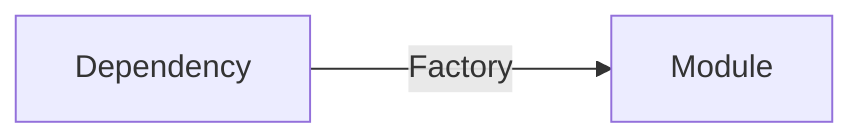
```mermaid
graph LR
Dependency-- Factory --->Module
```

## 工厂对象解析

Dependency的每个派生类预先确定其对应的工厂对象，该信息存储在compilation对象的dependencyFactories属性中。

```js
class EntryPlugin {
    apply(compiler) {
        compiler.hooks.compilation.tap(
            "EntryPlugin",
            (compilation, { normalModuleFactory }) => {
                compilation.dependencyFactories.set(
                    EntryDependency,
                    normalModuleFactory
                );
            }
        );

        const { entry, options, context } = this;
        const dep = EntryPlugin.createDependency(entry, options);

        compiler.hooks.make.tapAsync("EntryPlugin", (compilation, callback) => {
            compilation.addEntry(context, dep, options, err => {
                callback(err);
            });
        });
    }
}
class Compilation extends Tapable {
    addModuleTree({ context, dependency, contextInfo }, callback) {
        // ...
        const Dep = /** @type {DepConstructor} */ (dependency.constructor);
        const moduleFactory = this.dependencyFactories.get(Dep);
        if (!moduleFactory) {
            return callback(
                new WebpackError(
                    `No dependency factory available for this dependency type: ${dependency.constructor.name}`
                )
            );
        }
        this.handleModuleCreation(
            {
                factory: moduleFactory,
                dependencies: [dependency],
                originModule: null,
                contextInfo,
                context
            },
            (err, result) => {
                if (err && this.bail) {
                    callback(err);
                    this.buildQueue.stop();
                    this.rebuildQueue.stop();
                    this.processDependenciesQueue.stop();
                    this.factorizeQueue.stop();
                } else if (!err && result) {
                    callback(null, result);
                } else {
                    callback();
                }
            }
        );
    }
}
```

# Example Context

考虑两个项目：App1和App2.

- App1公开了一个Button组件，并设置了一个共享的React依赖：

```js
new ModuleFederationPlugin({
    name: 'component_app',
    filename: 'remoteEntry.js',
    exposes: {
        '.': './src/Button.jsx',
    },
    shared: {
        'react': {
            version: '2.3.2'
        }
    }
})
```

- App2使用App1提供的组件和库：

```js
new ModuleFederationPlugin({
    library: { type: 'module' },
    remotes: {
        'component-app': 'component_app@http://localhost:3001/remoteEntry.js',
    },
    shared: ['react'],
})
```

# 产物结构


构建过程之后会生成两种类型的产物：

- 入口文件
- Module chunk

入口文件公开了get和init方法以及moduleMap。

```js
var moduleMap = {
    "./src/Button.jsx": () => {
        return __webpack_require__.e(507).then(() => (() => ((__webpack_require__(507)))));
    }
};
var get = (module, getScope) => {
    __webpack_require__.R = getScope;
    getScope = (
        __webpack_require__.o(moduleMap, module)
            ? moduleMap[module]()
            : Promise.resolve().then(() => {
                throw new Error('Module "' + module + '" does not exist in container.');
            })
    );
    __webpack_require__.R = undefined;
    return getScope;
};
var init = (shareScope, initScope) => {
    if (!__webpack_require__.S) return;
    var oldScope = __webpack_require__.S["default"];
    var name = "default"
    if(oldScope && oldScope !== shareScope) throw new Error("Container initialization failed as it has already been initialized with a different share scope");
    __webpack_require__.S[name] = shareScope;
    return __webpack_require__.I(name, initScope);
};

__webpack_require__.d(exports, {
    get: () => (get),
    init: () => (init)
});
```

# 执行流程

执行顺序包括以下步骤：

- 加载共享的依赖（import react from 'react')
- 异步加载入口文件
- 使用远程模块（import Button from 'component-app'）

## 引用共享依赖(import react from 'react')

- 加载入口文件，因为此时入口文件是异步处理的，你可以看到__webpack_require__将被执行（ensureChunk：加载异步块内容）

```js
// module cache are used so entry inlining is disabled
/******/ 	// startup
/******/ 	// Load entry module and return exports
/******/ 	var __webpack_exports__ = __webpack_require__("./src/index.js");
```

- `__webpack_require__`将遍历ensureChunkHandlers(`__webpack_require__.f.XXXX`)，它包含`__webpack_require__.f.consumes`.

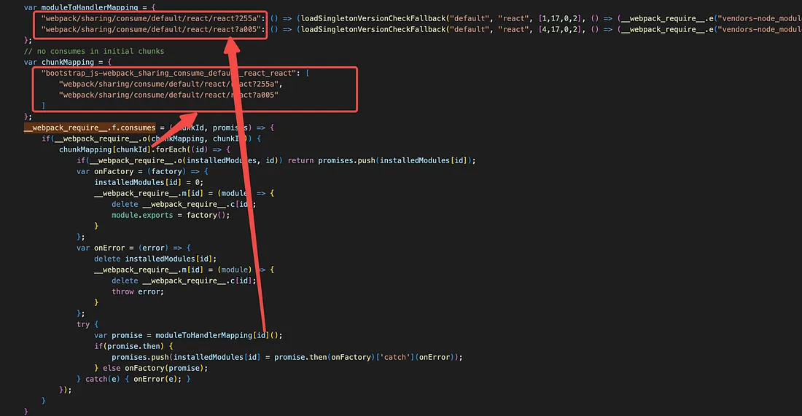

- 这里你可以看到在`shared`中配置的`react`，这次将遍历`chunkMapping['bootstrap_js-webpack_sharing_consume_default_react_react']`，并通过`moduleToHandlerMapping`映射表获得相应的`loadSingletonVersionCheckFallback`回调函数，执行返回一个promise，其中resolve返回一个factory函数。

- `loadSingletonVersionCheckFallback`将调用`__webpack_require__.I(RuntimeGlobals.initializeSharing)`，以初始化当前项目的sharedScope。

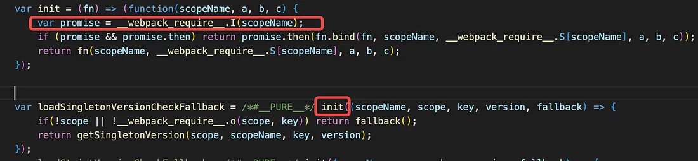

- 当`__webpack_require__`.I被执行，当前项目的共享依赖项（react）被注册，然后调用远程模块的入口文件（如果存在）公开的init方法

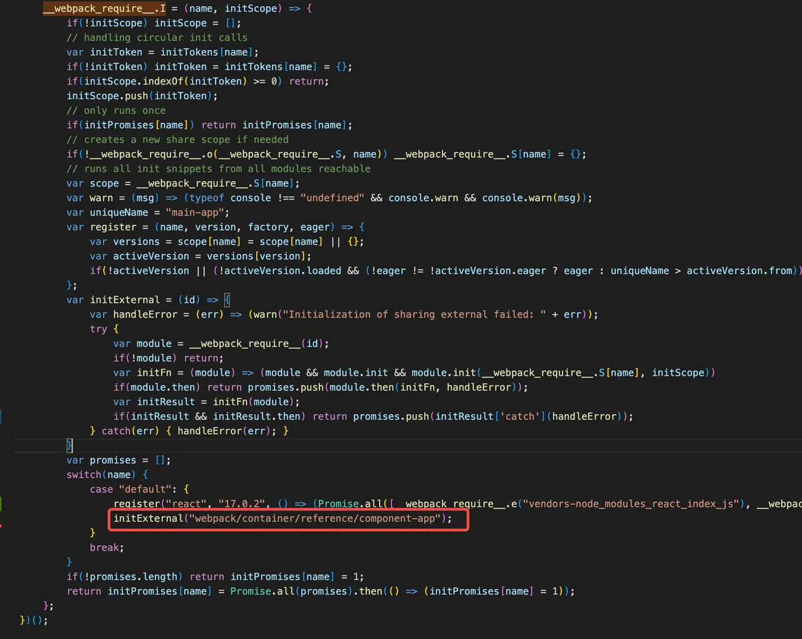

- 执行app1公开的init方法，该方法将传入app2的sharedScope，将app2设置的共享依赖项信息同步到app1

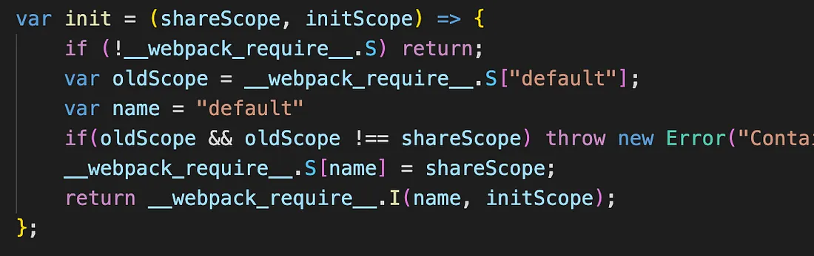

如果共享的依赖版本不同，则会有多个版本信息。shareScope信息如下所示:

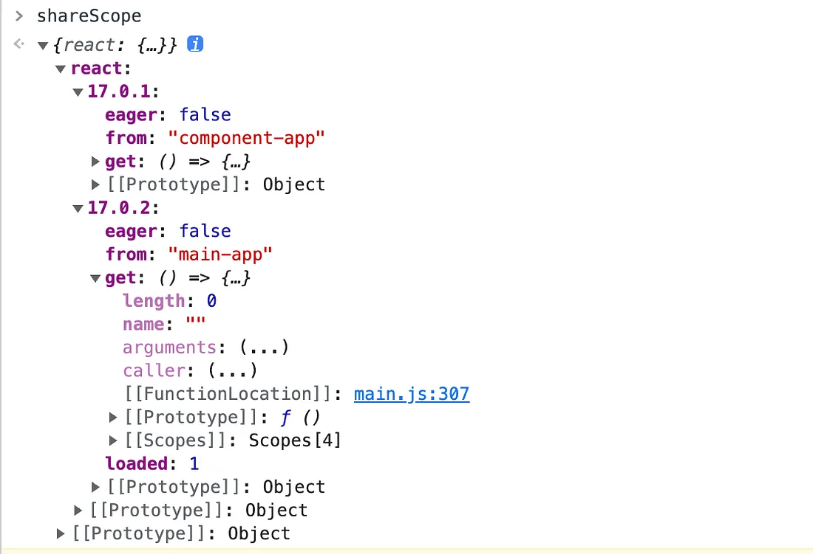

- 类似地，调用app1中的`__webpack_require__.I`也将采用与app2中相同的方法。但是，与app1不同的是，没有remotes字段，因此没有initExternal方法。下面是对用于初始化shareScope的注册函数的解释

```js
var register = (name, version, factory, eager) => {
 // Get all versions of react that have been registered
  var versions = (scope[name] = scope[name] || {});

  // Find out if 17.0.1 has been initialized
  var activeVersion = versions[version];

 // If one of the following conditions is met (i.e. the if statement below is true),
   // Mount app1's shared dependencies (such as react), otherwise reuse app2's shared dependencies (such as react):

   // 1. There is no corresponding module version in app2, that is, activeVersion is empty
   // 2. The old version is not loaded, and eager is not configured (forced loading)
   // 3. The old version is not loaded, and uniqueName of app1 > uniqueName of source module, see #12124 for details
   //(uniqueName is actually the main field of packagejson)

  if (
    !activeVersion ||
    (!activeVersion.loaded &&
      (!eager != !activeVersion.eager
        ? eager
 : uniqueName > activeVersion.from))
  )
    versions[version] = {
      get: factory,
      from: uniqueName,
      eager: !!eager,
    };
};
```

- 回到app2， `__webpack_require__.I`执行完成后，getSingletonVersion方法被执行。该方法主要用于获取满足需求的依赖版本。


- 获取到指定版本后，执行get方法以获取共享依赖项。

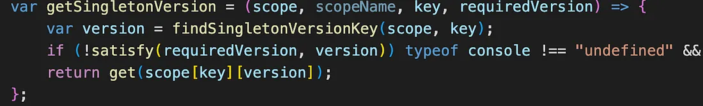

## 引用远程模块(`import Button from 'component-app'`)

在app1中，也公开了一个`get`方法。当引用相应的组件时，基本进程和引用共享依赖是一致的，区别在于最终的初始化将调用app1的`get`方法

# 源码分析

底层源代码可以分为三个主要部分：

- Expose Module：为其他项目公开特定模块
- 消费模块：消费远程模块
- Shared Dependency：跨模块共享依赖关系

## 暴露模块：`ContainerPlugin`的角色

Expose模块主要关注的是使项目中的特定模块可供其他项目使用。此功能的主要代码位于`webpack/lib/container/ContainerPlugin`中。

## 为什么命名为`ContainerPlugin`？

`ContainerPlugin`的名称来源于它的函数。`Module Federation`本身建立了一个容器，并在这个创建的容器中提供模块。然后可以跨不同的项目连接这些容器，使从一个项目公开的模块可以在另一个项目中使用。

## `ContainerPlugin`的核心功能

1. 向`compile Entry`添加指定模块：它利用`compilation.addEntry`添加需要公开的指定模块。

```js
compiler.hooks.make.tapAsync(PLUGIN_NAME, (compilation, callback) => {
    const dep = new ContainerEntryDependency(name, exposes, shareScope);
    dep.loc = { name };
    compilation.addEntry(
        compilation.options.context,
        dep,
        {
            name,
            filename,
            runtime,
            library
        },
        error => {
            if (error) return callback(error);
            callback();
        }
    );
});
```

2. 设置工厂对象：它使用`compiler.dependencyFactories.set`设置工厂对象。

```js
compiler.hooks.thisCompilation.tap(
    PLUGIN_NAME,
    (compilation, { normalModuleFactory }) => {
        compilation.dependencyFactories.set(
            ContainerEntryDependency,
            new ContainerEntryModuleFactory()
        );

        compilation.dependencyFactories.set(
            ContainerExposedDependency,
            normalModuleFactory
        );
    }
);
```

# 暴露模块流程

1. 添加入口文件（remoteEntry）：一个名为`remoteEntry`的条目文件被添加到项目中。

2. 将Exposed Module设置为Async Chunk：将公开的模块设置为异步块，允许动态导入。

3. 注入运行时代码：将额外的运行时代码附加到入口文件中，通常包括`get`和`init`等管理模块行为的方法

## 设置暴露模块
在工厂对象中，你可以看到`ContainerEntryDependency`的工厂对象是`ContainerEntryModuleFactory`。

`ContainerEntryModuleFactory`将提供一个`create`方法。它会获取到在前面的源码中添加的ContainerEntryDependency实例（dependency），其中包含由用户设置的名称、暴露和shareScope信息。

然后创建ContainerEntryModule:

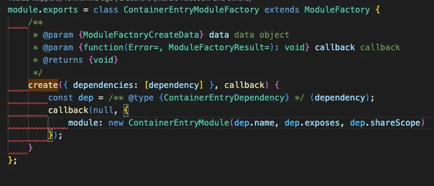

在构建`ContainerEntryModule`时，可以看到通过expose公开的模块作为异步代码被添加到块（`block`）中。并且`ContainerExposedDependency`将基于实际的文件路径被创建，这解释了为什么在前面的addEntry步骤中添加了ContainerExposedDependency。在添加依赖项和块(`block`)之后，模块构建过程将被递归调用。

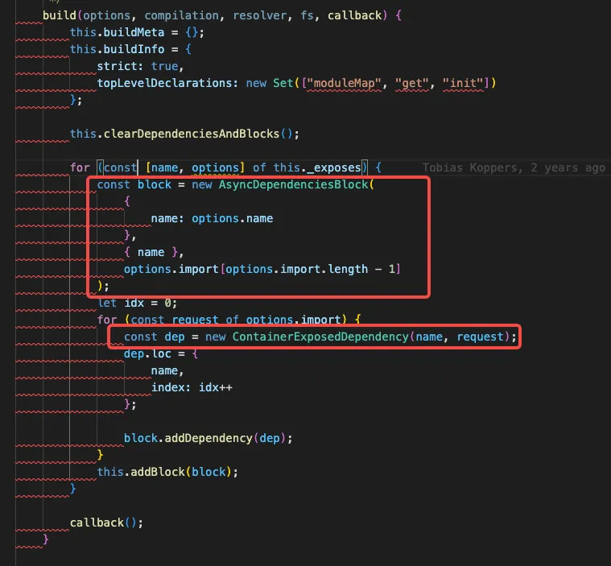

## 入口文件中加入运行时代码

`ContainerEntryModule`中的`CodeGeneration`将获得编译后指定的模块信息，并生成最终暴露的模块入口:

```js
codeGeneration({ moduleGraph, chunkGraph, runtimeTemplate }) {
    const source = Template.asString([
        `var moduleMap = {`,
        Template.indent(getters.join(",\n")),
        "};",
        `var get = ${runtimeTemplate.basicFunction("module, getScope", [
            `${RuntimeGlobals.currentRemoteGetScope} = getScope;`,
            // reusing the getScope variable to avoid creating a new var (and module is also used later)
            "getScope = (",
            Template.indent([
                `${RuntimeGlobals.hasOwnProperty}(moduleMap, module)`,
                Template.indent([
                    "? moduleMap[module]()",
                    `: Promise.resolve().then(${runtimeTemplate.basicFunction(
                        "",
                        "throw new Error('Module \"' + module + '\" does not exist in container.');"
                    )})`
                ])
            ]),
            ");",
            `${RuntimeGlobals.currentRemoteGetScope} = undefined;`,
            "return getScope;"
        ])};`,
        `var init = ${runtimeTemplate.basicFunction("shareScope, initScope", [
            `if (!${RuntimeGlobals.shareScopeMap}) return;`,
            `var oldScope = ${RuntimeGlobals.shareScopeMap}[${JSON.stringify(
                this._shareScope
            )}];`,
            `var name = ${JSON.stringify(this._shareScope)}`,
            `if(oldScope && oldScope !== shareScope) throw new Error("Container initialization failed as it has already been initialized with a different share scope");`,
            `${RuntimeGlobals.shareScopeMap}[name] = shareScope;`,
            `return ${RuntimeGlobals.initializeSharing}(name, initScope);`
        ])};`,
        "",
        "// This exports getters to disallow modifications",
        `${RuntimeGlobals.definePropertyGetters}(exports, {`,
        Template.indent([
            `get: ${runtimeTemplate.returningFunction("get")},`,
            `init: ${runtimeTemplate.returningFunction("init")}`
        ]),
        "});"
    ]);
}
```

## 流程总结：

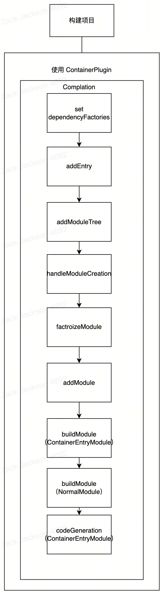

# RemoteModule Consumption

`ContainerReference`模块主要用于消费远程模块。它的主要实现在`webpack/lib/container/ContainerReferencePlugin`中。`ContainerReferencePlugin`简单易懂，主要做了四件事：

1. 添加远端模块到`external`
2. 设置工厂对象（`compile.dependencyFactories.set`）
3. 拦截远程模块的请求解析（`normalModuleFactory.hooks.factorize`）并返回到`生成RemoteModule`
4. 添加一个运行时模块`RemoteRuntimeModule`

## 添加远端模块到`external`

解析完传入的参数后，将远端模块添加到`external`：

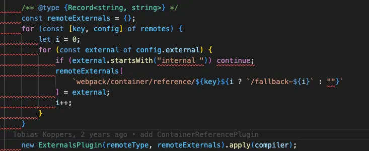

这也解释了为什么remotes参数和externals参数感觉如此相似。

## 设置工厂对象

然后为以后要使用的模块添加相应的工厂对象。

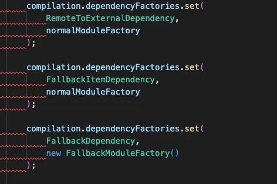

> 注意：这里设置了`fallback`，该模块只会在设置多个`external settings`时触发。

### 拦截远程模块`normalModuleFactory.hooks.factorize`的请求解析

接下来，阻塞模块请求，它返回一个自定义`RemoteModule`：

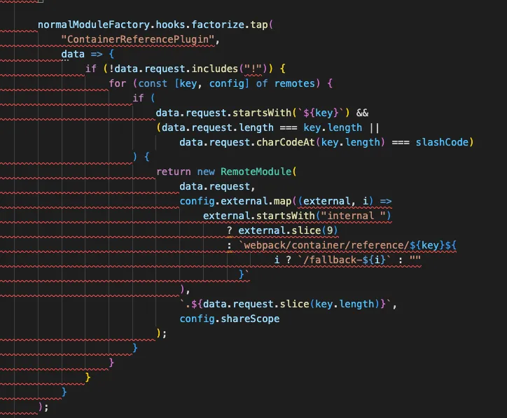

`remoteModule`主要用于收集相应的请求依赖项，收集需要初始化的远程模块及其`chunkId`，并将结果放在`codeGenerationResults`中，以便在初始化共享依赖项时使用（如果设置了共享依赖项，则需要先初始化共享依赖项，然后初始化远程模块）。

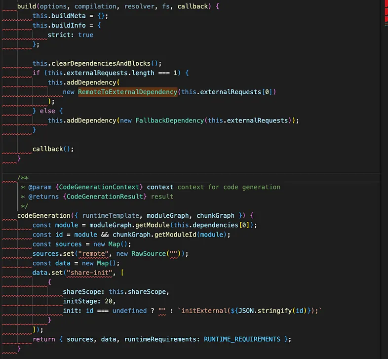

## 添加`RemoteRuntimeModule`

该模块将收集所有远程模块的编译的`chunkId`，并将其放置在`chunkMapping`中。相应地设置`RuntimeGlobals.ensureChunkHandlers`方法。当引用异步块时将调用此方法，当引用远程模块时，将调用相应的`get`方法来获取相应的远程模块。

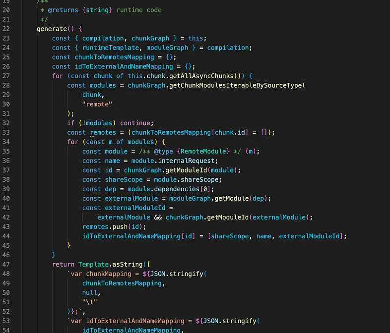

# 共享依赖

共享依赖主要用于在模块之间共享相同的依赖。
它的主要实现在`webpack/lib/sharing/SharePlugin`中共享依赖被分为两部分：消费共享依赖（`ConsumeSharedPlugin`）和提供共享依赖（`ProvideSharedPlugin`）。
`SharePlugin`仅进行参数解析并应用这两个插件。因此，它将分成两部分进行解析。

## 消费共享依赖(`ConsumeSharedPlugin`)

`ConsumeSharedPlugin`仅仅理解四件事：

1. 设置工厂对象
2. 拦截共享依赖的请求解析（`normalModuleFactory.hooks.factorize`），并返回一个自定义的`ConsumeSharedModule`
3. 为绝对路径拦截共享依赖的请求解析（`normalModuleFactory.hooks.createModule`）
4. 添加运行时模块

### 设置工厂对象

设置稍后要使用的模块工厂对象

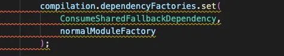

拦截共享依赖(`normalModuleFactory.hooks.factorize`)的请求解析

主要拦截模块请求（`import react from react`）和后缀请求（`import react from 'react/'`）。

拦截后，它将根据本地安装的依赖项/模块进行解析，并记录到`resolveContext`中，createConsumeSharedModule返回一个自定义的`ConsumeSharedModule`

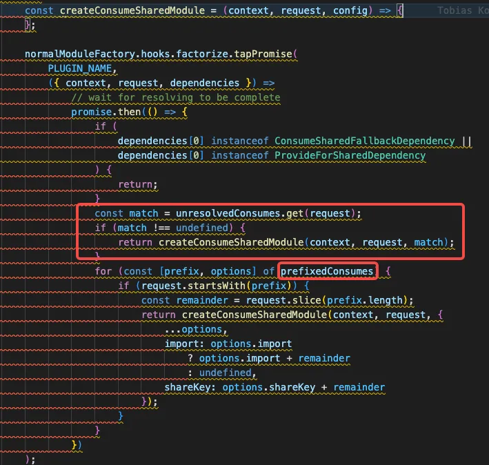

`ConsumeSharedModule`收集共享的依赖项和它们的`chunkId`，并将结果放在`sources`中，供共享依赖的运行时模块（`ConsumeSharedRuntimeModule`）使用。

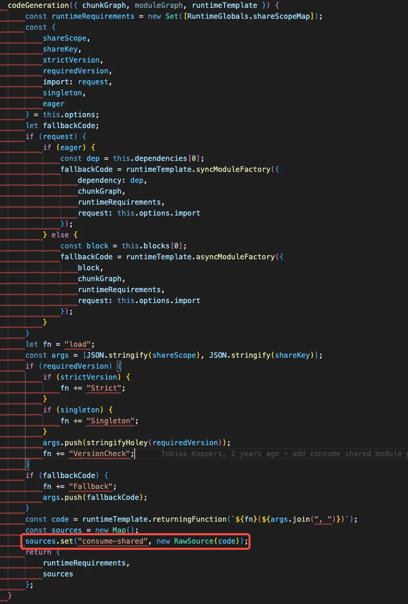

ConsumeSharedModule还将共享依赖添加到异步模块的`AsyncDependenciesBlock`中

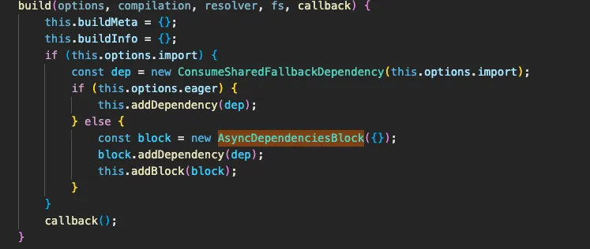

### 为绝对路径拦截共享依赖的请求解析

拦截带有绝对路径的请求，并返回一个自定义的ConsumeSharedModule:

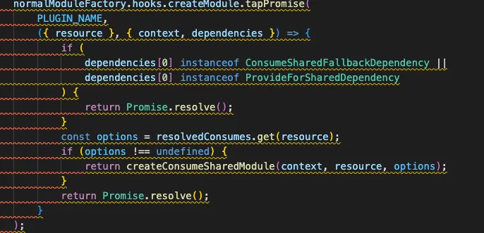

### 增加运行时模块`ConsumeSharedRuntimeModule`

模块使用由`ConsumeSharedModule`提供的数据，并生成初始化的共享依赖运行时代码：

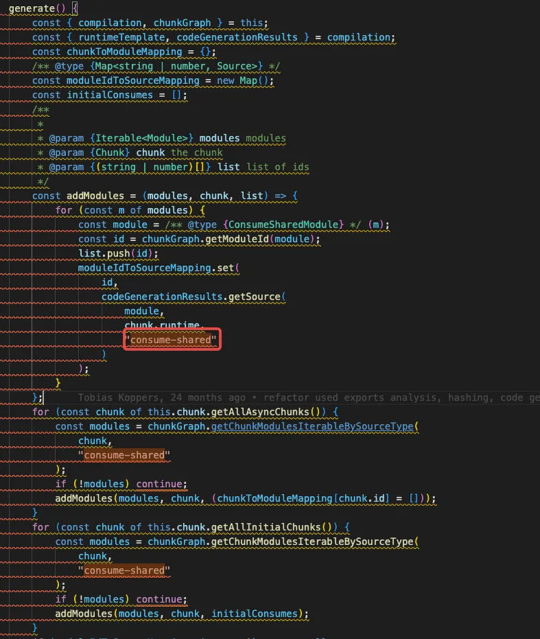

设置完成后，最终生产代码如下：

- 异步入口

当引用远程模块时，首先注册共享依赖项，然后加载远程模块。

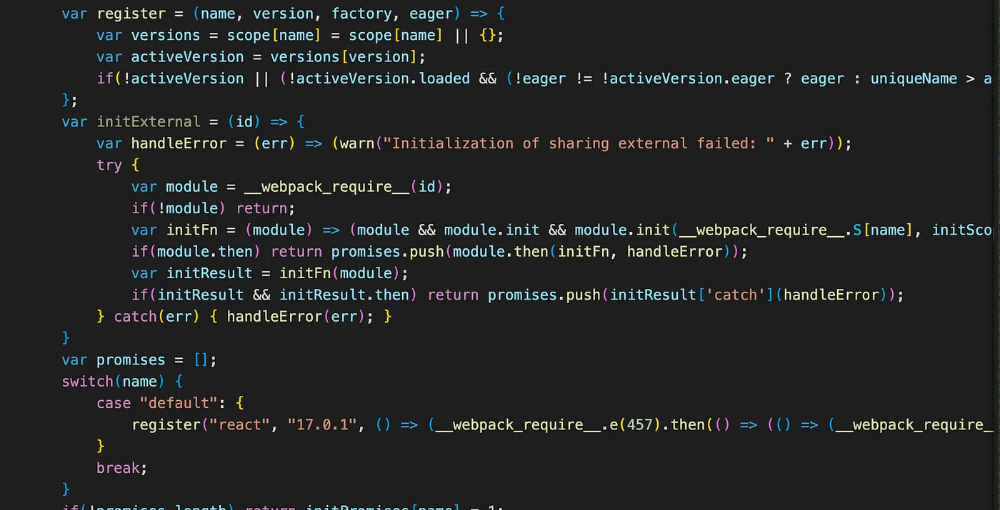

- 同步入口

加载共享依赖后，将其挂载在shareScope上，供其他模块使用

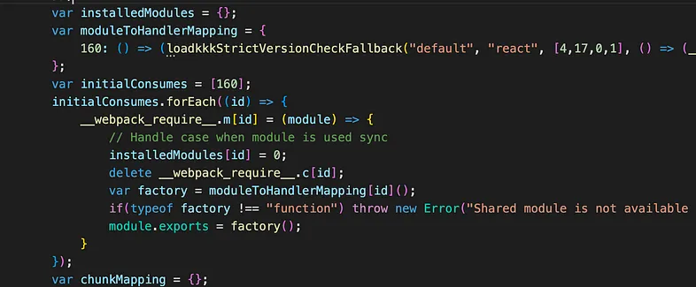

## 提供共享依赖

·ProvideSharedPlugin·做三件事：

1. 拦截共享依赖项的请求解析（normalModuleFactory.hooks.module）以收集所有共享依赖项的信息
2. 添加`Include`
3. 设置工厂对象

### 拦截共享依赖

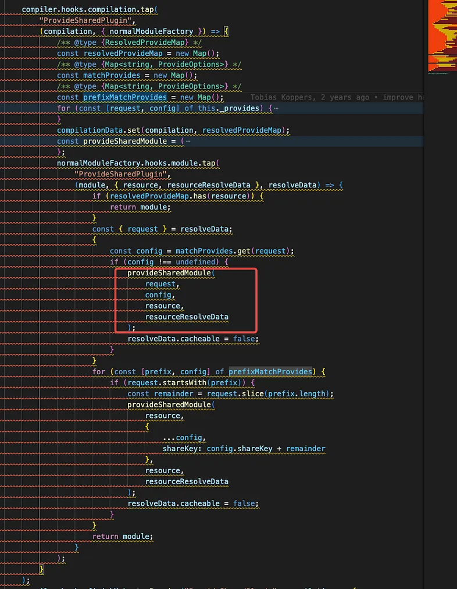

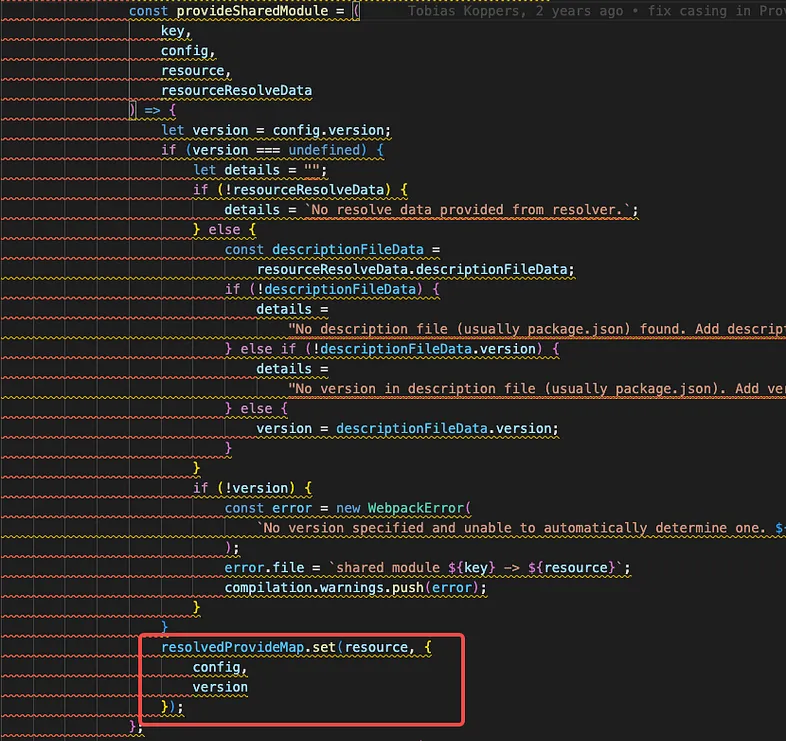

### Add Include

Add Include to finishMake

整体非常类似于addEntry，不同之处在于这个模块没有其他依赖关系？

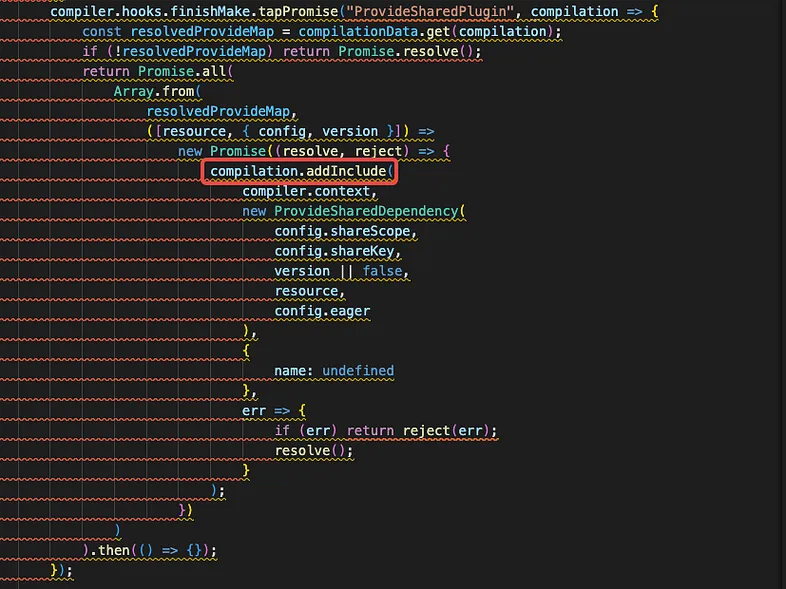

> Note: This hook does not appear in the official doc, and is only used by the module federation function

### 设置工厂对象

设置稍后要使用的模块工厂对象

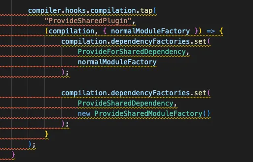

其中ProvideSharedDependency创建一个ProvideSharedModule模块。

ProvideSharedModule将共享信息，并基于拦截共享依赖项的请求来设置注册函数。此数据将在初始化共享依赖项时使用。

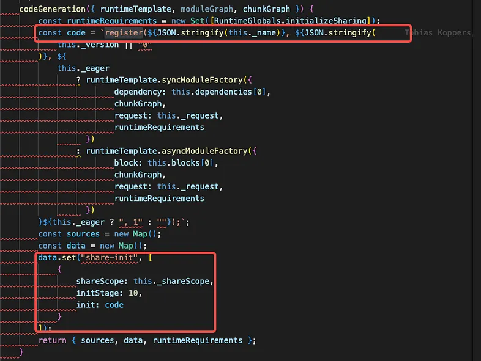

***[原文地址](https://scriptedalchemy.medium.com/understanding-webpack-module-federation-a-deep-dive-efe5c55bf366)***