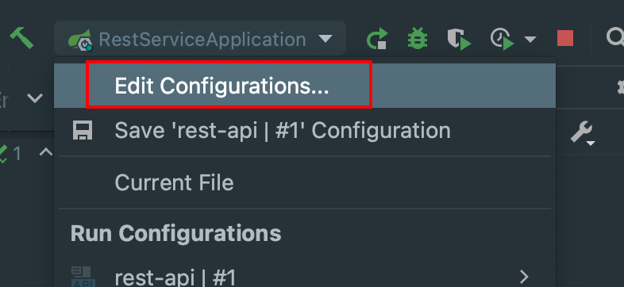
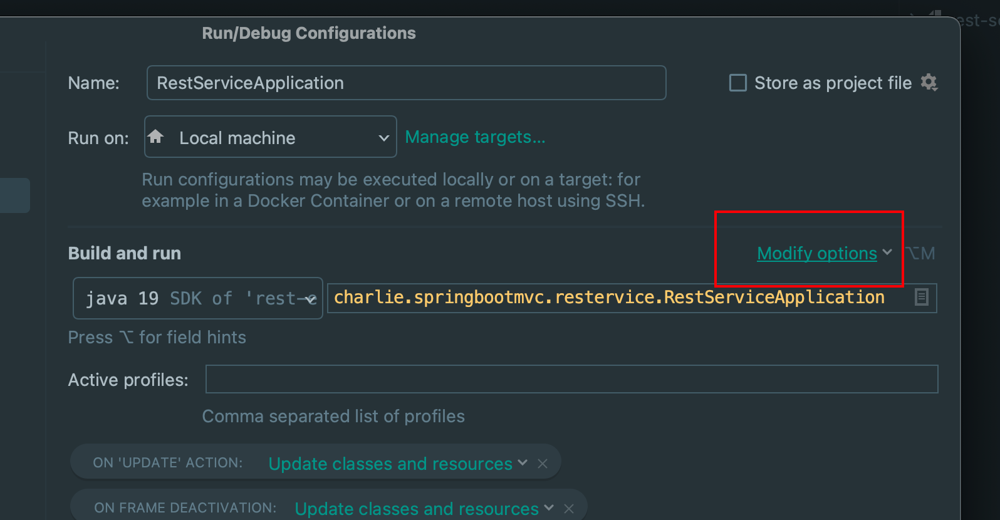
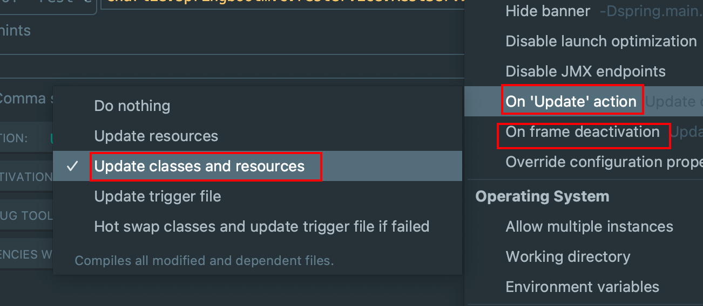

### 展开 Java 文件中的 import \* 🐝

1. 打开 `Preferences:`


2. 进入 Editor > Code Style > java， 打开 `import`Tab, 复选框勾选第一项 `Use single class import`, 并修改底部标注的部分为一个较大的数值，如 99. 最后保存修改。


### 文件更新时reload

1. 添加依赖：

   ```xml
   <dependency>
         <groupId>org.springframework.boot</groupId>
         <artifactId>spring-boot-devtools</artifactId>
   </dependency>
   ```
2. 修改配置：

   

   
   On 'Update' action 和 On frame deactivation都配置成Update classes and resources:

   
