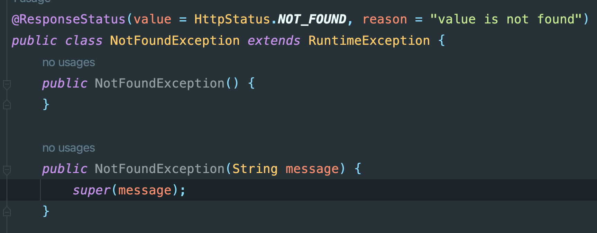

### Spring MVC中的异常处理

1. 在controller中注册异常处理器，这种方式只在当前controller中生效：

   ```java
   @ExceptionHandler(NotFoundException.class)
       public ResponseEntity handleNotFound() {
           return new ResponseEntity(HttpStatus.NOT_FOUND);
       }
   ```
2. 通过@ControllerAdvice注册全局的异常处理器：

   ```java
   @ControllerAdvice
   public class NotFountHandler {

       @ExceptionHandler(NotFoundException.class)
       public ResponseEntity handleNotFound() {
           return new ResponseEntity(HttpStatus.NOT_FOUND);
       }
   }
   ```
3. 使用@ResponseStatus注解：

   
