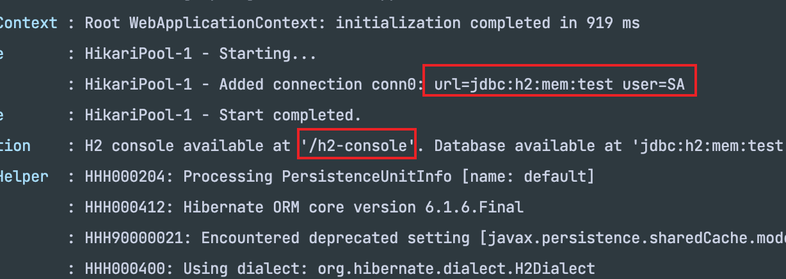
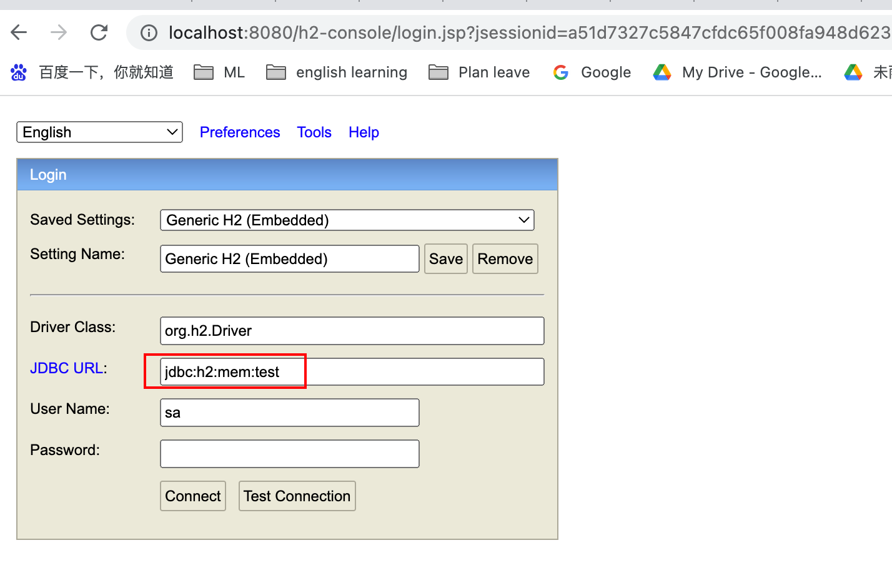

### 在SpringBoot项目中打开H2 Console

- 首先在application.properties中加入配置：

```
spring.h2.console.enabled=true
spring.datasource.url=jdbc:h2:mem:test
```

- 启动服务，console中可以看到以下提示：



- 在浏览器中打开链接：`localhost:8080/h2-console`, 修改JDBC Url后点击connect即可：


