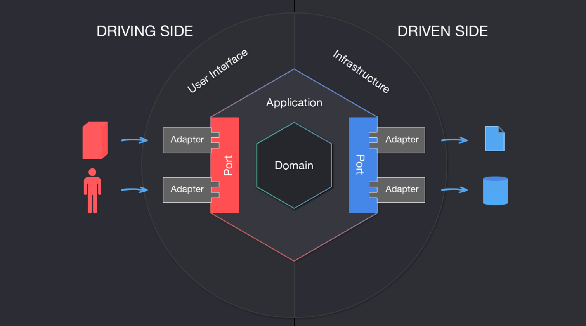

# 六边形架构


Photo by Giovanni C. Garnica on Unsplash

The goal of traditional Layered Architectures is to segregate(隔离) an application into different tiers, where each tier contains modules and classes that have shared or similar responsibilities, and work together to perform specific tasks.

There are different flavors（风格) of Layered Architectures and there’s no rule that determines how many layers should exist. The most common pattern is the 3 tier architecture, where the application is split into Presentation Layer, Logic Layer, and Data Layer.

In this book, Domain-Driven Design: Tackling Complexity in the Heart of Software(领域驱动设计：软件核心复杂性应对之道), Eric Evans proposes a 4-tier architecture to allow isolation between the Domain Layer which holds the business logic, and the other 3 supporting layers: User Interface, Application, and Infrastructure.

Following a Layered Architecture is beneficial in many ways, one and the most important being a separation of concerns（关注点分离). However, there’s always a risk. As there is no natural mechanism to detect when logic leaks between layers, one might — and probably will — end up with sprinkles（散置) of business logic in the user interface, or Infrastructure concerns mixed within the business logic.

In 2005, Alistair Cockburn realized that there wasn’t much difference between how the user interface and the database interact with an application, since they are both external actors which are interchangeable（可交换的) with similar components that would, in equivalent ways, interact with an application. By seeing things this way, one could focus on keeping the application agnostic（不可知论的) of these “external” actors, allowing them to interact via Ports and Adapters, thus avoiding entanglement and logic leakage between business logic and external components.

In this article, I will attempt to guide you through the main concepts of the Hexagonal Architecture, its benefits and caveats（警告), and depict（描述) in a simplistic way how you can profit（获益) from this pattern in your projects.


`<u>`The Hexagonal Architecture, also referred to as Ports and Adapters, is an architectural pattern that allows input by users or external systems to arrive into the Application at a Port via an Adapter, and allows output to be sent out from the Application through a Port to an Adapter. This creates an abstraction layer that protects the core of an application and isolates it from external — and somehow irrelevant — tools and technologies.`</u>`

# Ports(端口)

We can see a Port as a technology-agnostic entry point, it determines the interface which will allow foreign actors to communicate with the Application, regardless of who or what will implement said interface. Just as a USB port allows multiple types of devices to communicate with a computer as long as they have a USB adapter. Ports also allow the Application to communicate with external systems or services, such as databases, message brokers, other applications, etc.

**Pro tip: \*\***a Port should always have two items hooked to it, one always being a test.\*

# Adapters（适配器）

An Adapter will initiate the interaction with the Application through a Port, using a specific technology, for example, a REST controller would represent an adapter that allows a client to communicate with the Application. There can be as many Adapters for any single Port as needed without this representing a risk to the Ports or the Application itself.


# Application

The Application is the core of the system, it contains the Application Services which orchestrate（安排) the functionality or the use cases. It also contains the Domain Model, which is the business logic embedded in Aggregates, Entities, and Value Objects. The Application is represented by a hexagon which receives commands or queries from the Ports, and sends requests out to other external actors, like databases, via Ports as well.

When paired with Domain-Driven Design, the Application, or Hexagon, contains both the Application and the Domain layers, leaving the User Interface and Infrastructure layers outside.



# Why a Hexagon?

Alistair’s idea of using a Hexagon is merely to have a visual representation of the multiple Port/Adapter combinations an application might have, and also to depict（描述) how the left side of the application, or ‘driving side’, has different interactions and implementations compared to the right side, or ‘driven side’, more on this in a second.

# Driving Side vs Driven Side

Driving (or primary) actors are the ones that initiate the interaction, and are always depicted on the left side. For example, a driving adapter could be a controller which is the one that takes the (user) input and passes it to the Application via a Port.

Driven (or secondary) actors are the ones that are “kicked into behavior” by the Application. For example, a database Adapter is called by the Application so that it fetches a certain data set from persistence.

When it comes to implementation, there are a couple of important details that shouldn’t be missed:

- Ports will be (most of the time, depending on the language you choose) represented as interfaces in code.
- Driving Adapters will use a Port and an Application Service will implement the Interface defined by the Port, in this case both the Port’s interface and implementation are inside the Hexagon.
- Driven adapters will implement the Port and an Application Service will use it, in this case the Port is inside the Hexagon, but the implementation is in the Adapter, therefore outside of the Hexagon.


# Dependency Inversion（依赖反转) in the Hexagonal Architecture Context

The Dependency Inversion Principle is one of 5 principles coined by (Uncle) Bob Martin in his Paper OO Design Quality Metrics and later in his book Agile Software Development Principles, Patterns and Practices, where he defines it as follows:

- High-level modules should not depend on low-level modules. Both should depend on abstractions.
- Abstractions should not depend on details. Details should depend on abstractions.

As mentioned before, the left and right sides of the Hexagon contain 2 different types of actors, Driving and Driven where both Ports and Adapters exist.

On the Driving side, the Adapter depends on the Port, which is implemented by the Application Service, therefore the Adapter doesn’t know who will react to it’s invocations, it just knows what methods are guaranteed to be available, therefore it depends on an abstraction.

On the Driven side, the Application Service is the one that depends on the Port, and the Adapter is the one that implements the Port’s Interface, effectively inverting the dependency since the ‘low-level’ adapter (i.e. database repository) is forced to implement the abstraction defined in the application’s core, which is ‘higher-level’.

# Why Should I Use Ports and Adapters?

There are many advantages of using the Ports and Adapters Architecture, one of them is to be able to completely isolate your application logic and domain logic in a fully testable way. Since it does not depend on external factors, testing it becomes natural and mocking its dependencies is easy.

It also lets you design all your system’s interfaces ‘by purpose’ rather than by technology, preventing you from lock-in, and making it easier for your application’s tech stack to evolve with time. If you need to change the persistence layer, go for it. If you need to allow your app to be called by Slack bots instead of humans, you got it! All you need to do is implement new Adapters and you’re good to go.

The Ports and Adapters architecture also plays along very well with Domain-Driven Design, the main advantage it brings is that it shields domain logic to leak out of your application’s core. Just be vigilant（警觉地) of leakage between Application and Domain layers.

# Structuring Your App & Code Examples

In this section, we will implement a highly simplified version of a service that processes requests to create orders for a fictitious（虚构的) ecommerce application.

_Please note that the examples intentionally omit certain parts and disregard（忽视) important aspects of well-written code, such as error handling and proper naming, to focus on the basic concepts of implementing Ports and Adapters._

It’s important to highlight that all layers of Domain-Driven Design’s Layered Architecture are still suitable when structuring an application based on Ports and Adapters, as they provide an ideal segregation（隔离) for all components.

In our fictitious app the controller would be the Driving Adapter, which uses the Driving Port.

```javascript
/**
 * Driving Adapter
 * Location: src/user-interface/adapter/OrderAdapter.ts
 */
class OrderAdapter extends HttpRequestHandler {

    private orderService: DrivingPort;

    constructor(orderService: DrivingPort) {
        super();
        this.orderService = orderService;
    }

    public async createOrder(req: Request): Promise<Response> {
        const createOrderCommand = new CreateOrderCommand(req);
        const orderResult = await this.orderService.handle(createOrderCommand);

        return this.createResponse(orderResult);
    }
}
```

The Driving Port would be an interface in the Application Layer, or Hexagon.

```javascript
/**
 * Driving Port
 * Location: src/domain/port/DrivingPort.ts
 */
interface DrivingPort {
  handle(command: OrderCommand): Promise<boolean>;
}
```

The Application Service would implement the Driving Port.

```javascript
/**
 * Application service implementing Driving Port
 * Location: src/application/service/OrderService.ts
 */
class OrderService implements DrivingPort {

    private order: Order;
    private orderRepository: DatabasePort;

    constructor(orderRepository: DatabasePort) {
        this.orderRepository = orderRepository;
    }

    public async handle(command: CreateOrderCommand): Promise<boolean> {
        this.order = Order.create(command);

        try {
            return await this.orderRepository.save(this.order);
        } catch (error) {
            return false;
        }
    }
}
```

As you can see, the Application Service, being the orchestrating component, would use the Driven Port.

```javascript
/**
 * Driven Port
 * Location: src/domain/port/DatabasePort.ts
 */
interface DatabasePort {
  save(aggregate: Aggregate): Promise<boolean>;
}
```

Finally, the Driven Port would be implemented by the Driven Adapter.

```javascript
/**
 * Order repository implementing Driven Port
 * Location: src/infrastructure/repository/OrderRepositoryAdapter.ts
 */
class OrderRepositoryAdapter extends Repository implements DatabasePort {

    public async save(order: Aggregate): Promise<boolean> {
        return await this.insert(order)
    }
}
```

# Conclusion

The Hexagonal or Ports and Adapters Architecture, is not the silver bullet for all applications. It involves a certain level of complexity, that when handled with care, will bring great benefits to your system. But if broken windows are allowed, it might cause a lot of headaches.

When properly implemented and paired with other methodologies, like Domain-Driven Design, Ports and Adapters can ensure an application’s long term stability and extensibility, bringing a great deal of value to the system and the enterprise.

[原文地址]：https://medium.com/ssense-tech/hexagonal-architecture-there-are-always-two-sides-to-every-story-bc0780ed7d9c
