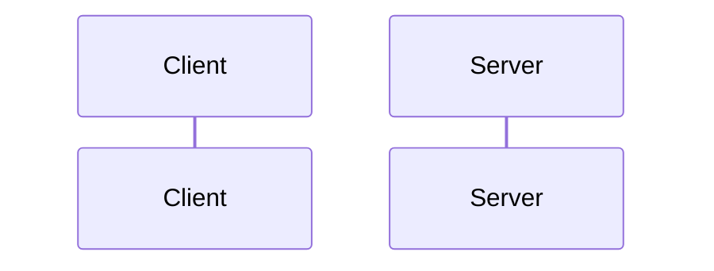
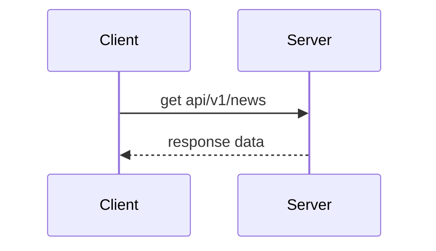
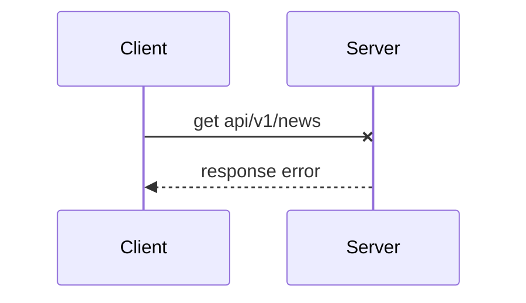
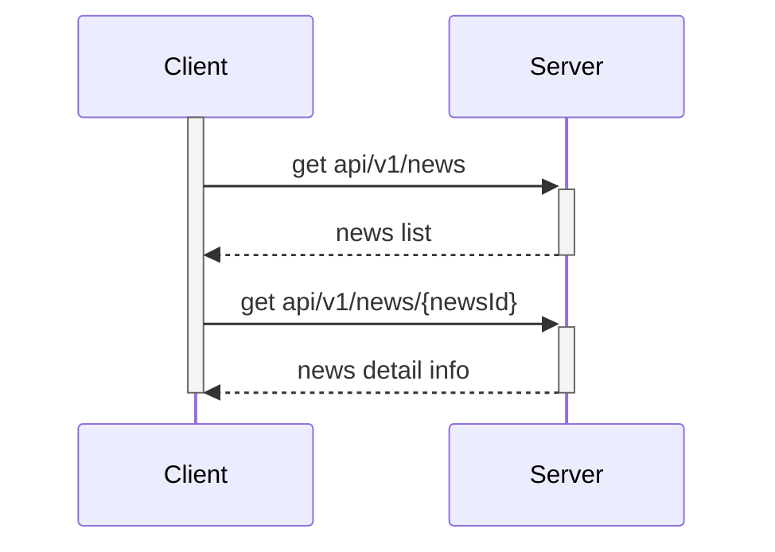
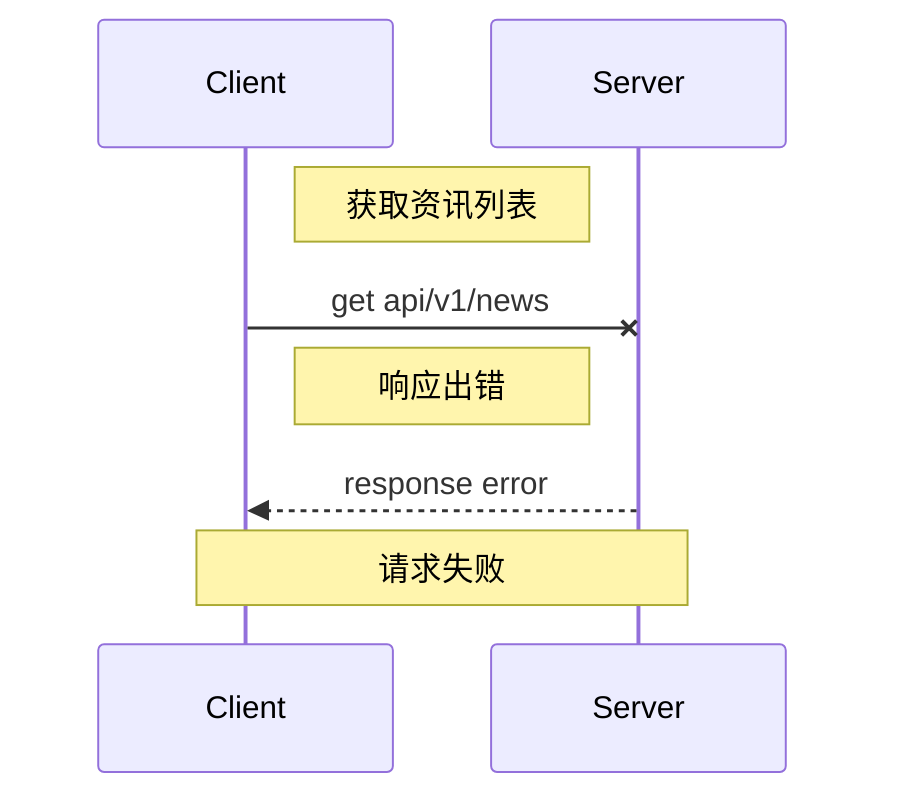
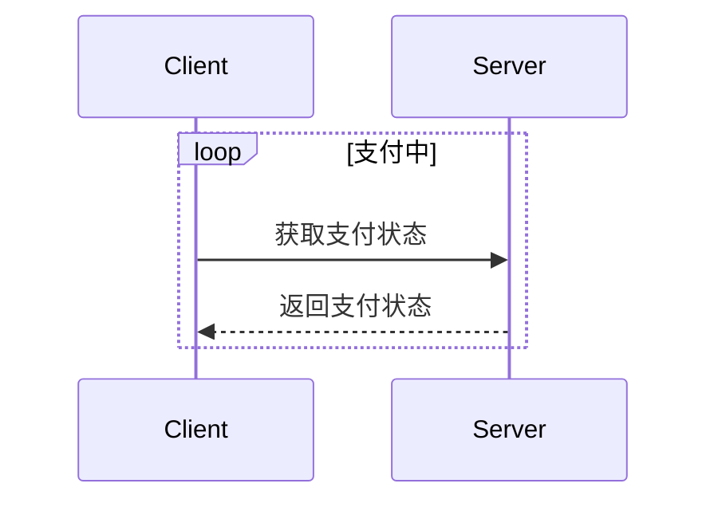
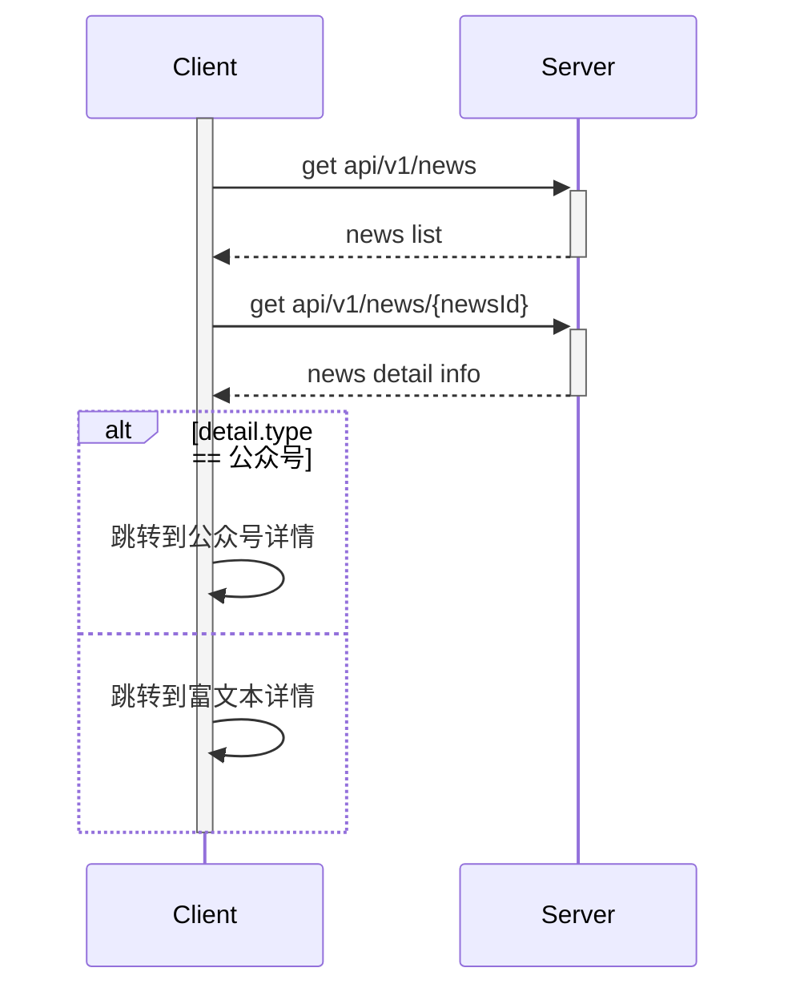
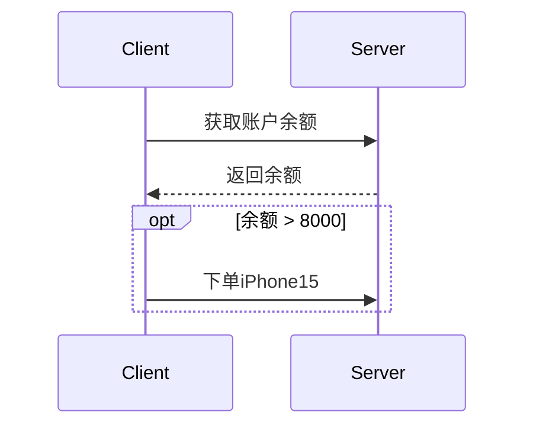
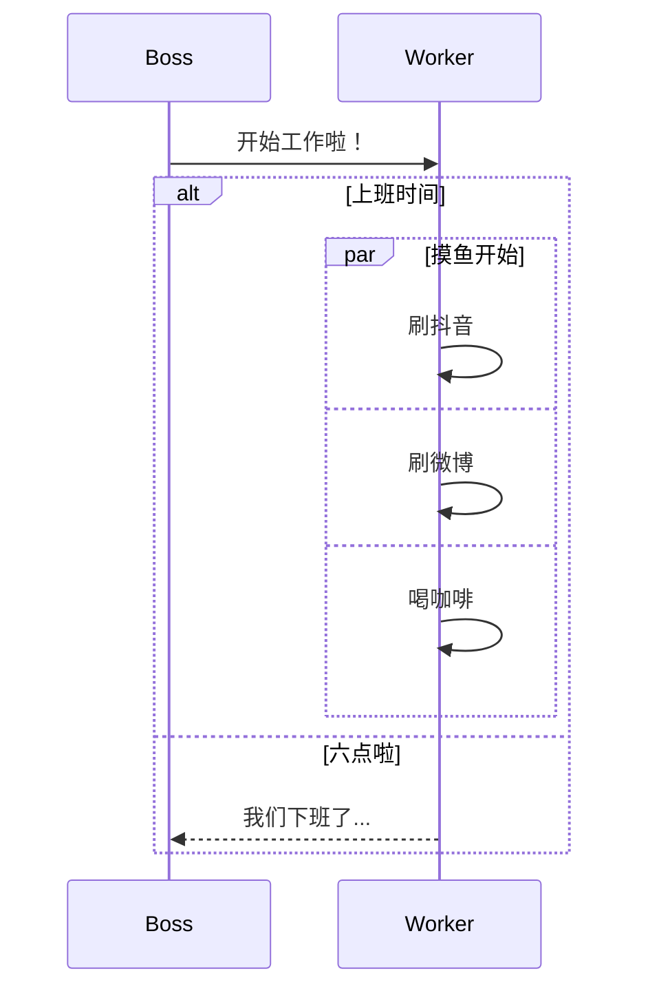
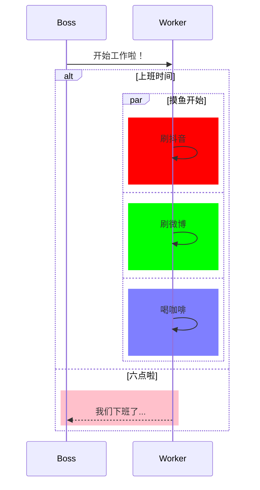

时序图用于表示参与者之间如何交互以及交互顺序，主要的元素包括：参与者、消息、注释、激活框、循环（loop）、可选（opt）、选择（alt）等。

时序图的基本语法：



### 参与者

表示交互的对象，添加参与者的语法：`participant alias_name as display_name`:



可以使用别名：


### 消息

参与者之间通过消息传递信息，消息的语法格式为：`<参与者> <箭头> <参与者> : <描述信息>`， 描述信息可以为空但不能省略。
箭头的格式有以下几种：

- ->: 无箭头实线
- -->: 无箭头虚线
- ->>: 有箭头实线(主动发送消息)
- -->>: 有箭头虚线（响应）
- -x: 末尾带x的实线
- --x: 末尾带x的虚线
- -): 空心箭头
- --): 空心箭头

示例：



### 激活框

激活框可以在接收方时间线上标记一段时间，用于表示处理消息的时间间隔。有两种方式创建激活框：

1. 直接激活（通过activate/deactivate）
2. 在对象前面加上加减号（+/-）激活：加号开始，减号结束

示例：



### 注释

注释的语法为： `note [位置] [对象1，对象2...] : 注释文本`；

位置有三种取值：`left of`, `right of`, `over`;



### 循环（loop）

当条件满足是重复发送消息，语法格式：

```
loop 循环条件
[消息流]
end
```

示例：



### 选择（alt）

选择会对多个条件作出判断，针对不同的条件发送不同的消息流，类似于if-else。语法格式如下：

```
alt 条件说明
  [消息流]
else
  [消息流]
else
  [消息流]
end
```

示例：



### 可选（opt）

条件满足是执行消息流，类似于单分支的if。语法格式为：

```
opt 条件
[消息流]
end
```

示例：



### 并行（par）

消息被分成多个片段并行执行，语法格式如下：

```
par [description]
[message]
and
[message]
end
```

示例：



### 背景颜色

语法格式：

```
rect rgb(r, g, b)/red/black/...
[message stream]
end
```

示例：


