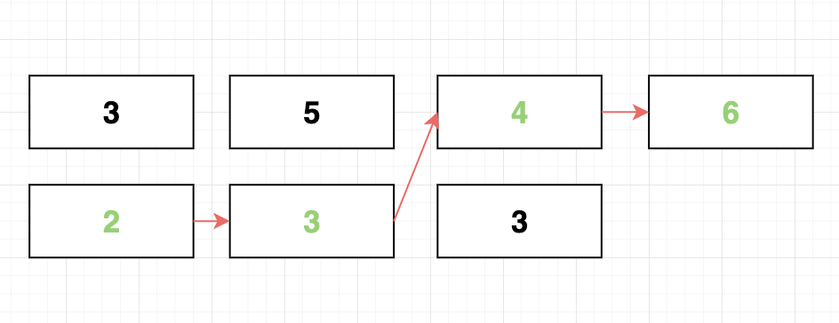

## 简介

最长递增子序列（lis)指的是一个序列的子序列，子序列满足所有的元素大小是递增的且是最长的序列，元素不一定相邻。例如序列：

    A = (3, 2, 5, 6, 4)

的最长子序列为(3, 5, 6) 或 (2, 5, 6)。

有两种方法计算最长递增子序列：`动态规划` 和 `二分查找法`;

## 计算最长递增子序列

### 动态规划法

首先定义一个数组 dp，dp[i]指的是以元素$A[i]$为最后一个元素的子序列的长度，以简介中的序列为例，以 A[0]为最后一个元素的子序列的长度为 1， 因为只有一个元素；同理以 A[1]为最后一个元素的子序列的长度同样为 1...所以 dp 最终的内容为[1, 1, 2, 3, 2]，最长递增子序列的长度就是 dp 中的最大值。

动态规划通过将问题拆解为更小规模的子问题进行求解，那如何通过动态规划来构建 dp 数组呢？

换句话说假如已经知道 dp[j]的值，其中$0 < j < i$，那么该如何计算 dp[i]，方法就是比较 A[i]与 A[j]的值，如果 A[i] > A[j], 那么 dp[i]的值就是 dp[j] + 1, 否则 dp[i]保持不变。因为是与每一个 A[j]进行比较，所以可以获取到以 dp[i]的最大值。有人可能会问那 dp[j]的值怎么来的，通过数学归纳法的原理，且已知 dp[0]等于 1（因为只有一个元素），后面的值可以一次求得。

具体的代码实现如下：

```javascript
function lis(list) {
  const dp = new Array(list.length).fill(1);
  for (let i = 0; i < list.length; i++) {
    for (let j = 0; j < i; j++) {
      if (list[i] >= list[j]) {
        dp[i] = Math.max(dp[j] + 1, dp[i]);
      }
    }
  }

  return Math.max.apply(null, dp);
}
```

但是通过上面的这种方法只能获取到最长递增子序列的长度，如果还想知道子序列具体包含哪些元素，则需要定义一个新的数组 P，其中 P[i]就指的是当 dp[i]是由 dp[j] + 1 得到时 j 的值。假设 A[i]是最长递增子序列中的最后一个元素，那么 P[i]就是子序列中倒数 d 第二个元素的索引，同理 P[P[i]]就是倒数第三个元素的索引...以此类推就可以获取到最长递增子序列中所有元素的索引位置。

扩展之后的代码如下：

```javascript
/**
 * 最长递增子序列
 */
function lis(list) {
  const dp = new Array(list.length).fill(1);
  const prev = new Array(list.length).fill(-1);
  for (let i = 0; i < list.length; i++) {
    for (let j = 0; j < i; j++) {
      if (list[i] >= list[j]) {
        // dp[i] = Math.max(dp[j] + 1, dp[i]);
        if (dp[j] + 1 > dp[i]) {
          dp[i] = dp[j] + 1;
          prev[i] = j;
        }
      }
    }
  }

  let maxIndex = 0;
  let maxValue = dp[0];
  for (let i = 1; i < list.length; i++) {
    if (dp[i] > maxValue) {
      maxValue = dp[i];
      maxIndex = i;
    }
  }

  let i = maxIndex;
  const result = [];

  while (prev[i] !== -1) {
    result.unshift(i);
    i = prev[i];
  }

  result.unshift(i);

  return result;
}
```

### 二分查找法

二分法获取最长子序列的方式类似于 `蜘蛛纸牌`游戏，每次取出一张纸牌，如果纸牌的点数小于从左往右的某一个牌堆最上面的纸牌的点数，则将纸牌加入到该牌堆，否则在右侧创建新的牌堆，直到所有的纸牌都分发完毕，最后的牌堆的数量就是递增子序列的长度。

以序列[3, 2, 5, 3, 4, 6, 3]为例：

最开始还没有牌堆，所以第一个元素 3 被放在了第一个排队；元素 2 小于第一个排队中的 3，所以被放在第一个牌堆，此时第一个牌堆中最上面的元素就是 2； 元素 5 大于第一个牌堆中的 2， 所以被放在一个新的牌堆中，此时牌堆数量为 2，分别为[3, 2] 和[5]......

最终结果如下图：



从图中可以看到，总共有四堆牌，所以最长递增子序列的长度为 4，对应的元素分别为[2, 3, 4, 6],元素一次出现在从左到右的每一个牌堆中。

具体代码实现如下：

```js
function lis2(list) {
  const top = [list[0]];
  const result = [0];
  for (let i = 1; i < list.length; i++) {
    const item = list[i];
    if (item > top[top.length - 1]) {
      top.push(item);
      result.push(i);
      continue;
    }
    let left = 0,
      right = top.length;
    while (left < right) {
      const mid = ((left + right) / 2) | 0;
      if (item >= top[mid]) {
        left = left === mid ? mid + 1 : mid;
      } else if (item < top[mid]) {
        right = mid;
      }
    }
    top[left] = item;
    if (left === top.length - 1) {
      result[left] = i;
    }
  }
  return result;
}
```

在代码实现中，最终会获取到递增子序列中每一个元素的索引位置。

虽然我们知道最长递增子序列的元素会出现在每一个牌堆中，但是并不知道具体是哪一个元素，那么是如何确定该元素呢？
对于每一个待放入牌堆中的元素，要么被放在了新的牌堆，要么被放入已存在的牌堆；如果没有别放在新的牌堆或者最后一个牌堆，那么该元素就一定不会出现在子序列中（因为子序列中的元素是依次从每一个牌堆中取出一个，如果被放在了之前的牌堆中，那么意味着该元素出现在了子序列最后一个元素的前面，所以该元素一定不会出现在最终的子序列中）。

在代码实现中，定义了一个 `result` 数组，用于存放子序列中元素的索引位置。如果一个元素被放入了新的牌堆或最后一个排队则说明该元素有可能出现在递增子序列中，因此将元素的索引记录到 result 相应的位置中，最终 result 中就顺序记录了所有子序列中元素的索引位置。
